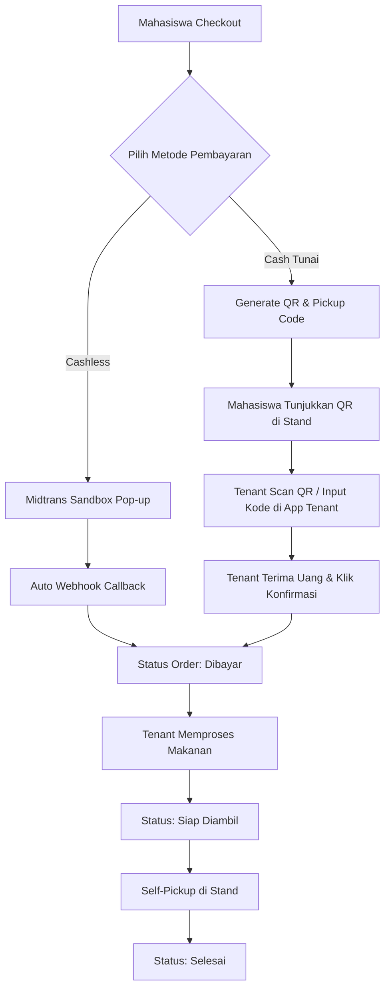
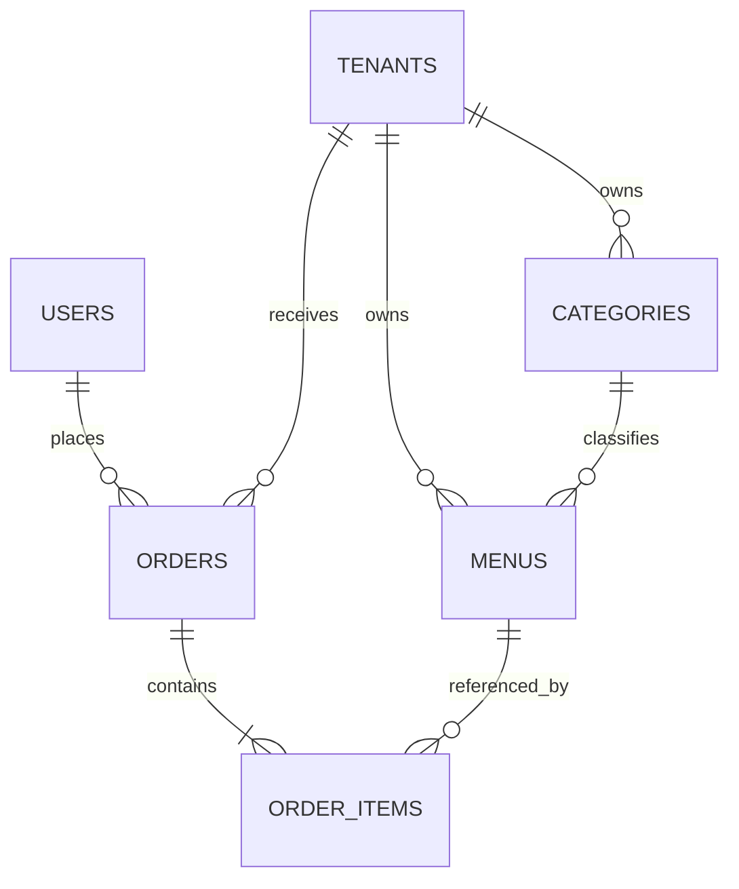

# Smart Canteen FEB 🍱


**Smart Canteen FEB** adalah aplikasi web demonstrasi (*dummy / demo website*) untuk sistem pemesanan makanan dan minuman mandiri (**Self-Pickup**) di lingkungan Fakultas Ekonomika dan Bisnis (FEB). Aplikasi ini dirancang untuk menghadirkan pengalaman pemesanan yang modern, cepat, dan transparan dengan dukungan **Dual Payment System (Cashless & Cash QR Scan)**.

---

## 📌 Batasan & Informasi Proyek

* **Jenis Proyek:** Website Demo / Prototype UI-UX
* **Budget Development:** Rp1.000.000
* **Estimasi Pengerjaan:** 5–7 Hari Kerja
* **Model Bisnis Pengambilan:** **Self-Pickup** (Ambil Sendiri di Stand Kantin FEB)

---

## ⚡ Fitur Utama

### 🛍️ 1. Modul Mahasiswa (Customer)
* **Katalog Ber-Kategori:** Jelajahi tenant/stand kantin dan saring menu berdasarkan kategori (Makanan Utama, Minuman, Camilan).
* **Keranjang & Checkout Flexible:** Atur kuantitas item dan pilih metode pembayaran sesuai kebutuhan.
* **Dual Payment Options:**
  - **Cashless:** Pembayaran digital real-time terintegrasi dengan **Midtrans Sandbox**.
  - **Cash (Tunai):** Menghasilkan Kode QR & String Pengambilan unik (cth: `FEB-8921`) untuk pembayaran langsung di stand.
* **Live Order Tracker:** Pantau perkembangan status pemesanan secara langsung (`Menunggu Pembayaran` $\rightarrow$ `Dibayar` $\rightarrow$ `Diproses` $\rightarrow$ `Siap Diambil` $\rightarrow$ `Selesai`).

### 🏪 2. Modul Tenant (Penjual / Pemilik Stand)
* **Cash QR Scanner & Verifier:** Fitur scan kamera / input kode pesanan untuk memverifikasi pembayaran tunai dan mengubah status menjadi `Dibayar`.
* **Order Status Board:** Papan manajemen pesanan masuk untuk memproses makanan hingga status `Siap Diambil`.
* **Category & Menu Management:** Kelola kategori dan daftar menu makanan/minuman dengan dukungan **Soft Deletes**.

### 🛡️ 3. Modul Admin (Pengelola Sistem)
* **Dashboard Supervision:** Pantau statistik transaksi demo, rasio pembayaran Cash vs Cashless, dan aktivitas kantin.
* **Master Data Management:** Kelola tenant dan data pengguna beserta peran (`mahasiswa`, `tenant`, `admin`).

---

## 🔄 Dual Payment System & Flow



---

## 🗄️ Database ERD & Data Integrity

Aplikasi menerapkan **Soft Deletes (`deleted_at`)** pada entity krusial (`users`, `tenants`, `menus`, `orders`) serta **Snapshot Data** (`menu_name` & `price`) pada `order_items` untuk menjamin integritas riwayat transaksi.



---

## 📂 Struktur Dokumentasi Proyek (`docs/`)

Seluruh spesifikasi teknis dan aturan bisnis terdokumentasi lengkap di folder `docs/`:

1. 📄 [00-project-overview.md](file:///home/darbi/Projects/smart_canteen/docs/00-project-overview.md) — Overview & Batasan Proyek
2. 📄 [01-scope.md](file:///home/darbi/Projects/smart_canteen/docs/01-scope.md) — Scope Utama & Batasan Sistem
3. 📄 [02-requirements.md](file:///home/darbi/Projects/smart_canteen/docs/02-requirements.md) — Functional & Non-Functional Requirements
4. 📄 [03-user-flow.md](file:///home/darbi/Projects/smart_canteen/docs/03-user-flow.md) — User Flow & Diagrams (Mermaid)
5. 📄 [04-user-roles.md](file:///home/darbi/Projects/smart_canteen/docs/04-user-roles.md) — Matriks Hak Akses Spatie Permission
6. 📄 [05-feature-specification.md](file:///home/darbi/Projects/smart_canteen/docs/05-feature-specification.md) — Spesifikasi Fitur Per Modul
7. 📄 [06-page-specification.md](file:///home/darbi/Projects/smart_canteen/docs/06-page-specification.md) — Spesifikasi Halaman & Layout
8. 📄 [07-ui-ux-guidelines.md](file:///home/darbi/Projects/smart_canteen/docs/07-ui-ux-guidelines.md) — Design System & UI States
9. 📄 [08-data-model.md](file:///home/darbi/Projects/smart_canteen/docs/08-data-model.md) — ERD & Schema Database (SoftDeletes & Snapshots)
10. 📄 [09-payment-flow.md](file:///home/darbi/Projects/smart_canteen/docs/09-payment-flow.md) — Midtrans Sandbox & Cash QR Scan Integration
11. 📄 [10-status-order.md](file:///home/darbi/Projects/smart_canteen/docs/10-status-order.md) — Order State Machine & Audit Timestamps
12. 📄 [11-demo-scenarios.md](file:///home/darbi/Projects/smart_canteen/docs/11-demo-scenarios.md) — Langkah-Langkah Skenario Demo
13. 📄 [12-technical-guidelines.md](file:///home/darbi/Projects/smart_canteen/docs/12-technical-guidelines.md) — Arsitektur & Guideline Pengembangan
14. 📄 [13-development-rules.md](file:///home/darbi/Projects/smart_canteen/docs/13-development-rules.md) — Rules Pengembangan & Prinsip Vibe Coding
15. 📄 [14-out-of-scope.md](file:///home/darbi/Projects/smart_canteen/docs/14-out-of-scope.md) — Fitur Di Luar Scope
16. 📄 [15-acceptance-criteria.md](file:///home/darbi/Projects/smart_canteen/docs/15-acceptance-criteria.md) — Kriteria Keterterimaan (Definition of Done)
17. 📄 [16-rab.md](file:///home/darbi/Projects/smart_canteen/docs/16-rab.md) — Breakdown Rencana Anggaran Biaya & Timeline

---

## 🛠️ Cara Menjalankan Aplikasi Secara Lokal

### Prerequisites
* PHP >= 8.4
* Composer
* Node.js >= 20.x & NPM

### Langkah-Langkah Setup

```bash
# 1. Clone repository
git clone https://github.com/Hnzsama/smart_canteen.git
cd smart_canteen

# 2. Install dependensi Composer & NPM
composer install
npm install

# 3. Copy file environment & setup key
cp .env.example .env
php artisan key:generate

# 4. Run database migrations & seeders
php artisan migrate --seed

# 5. Jalankan server lokal & Vite
php artisan serve
npm run dev
```

Buka `http://localhost:8000` pada browser Anda.

---

## 📝 Lisensi
Proyek ini dibuat untuk kebutuhan demo dan pembelajaran internal di lingkungan FEB.
