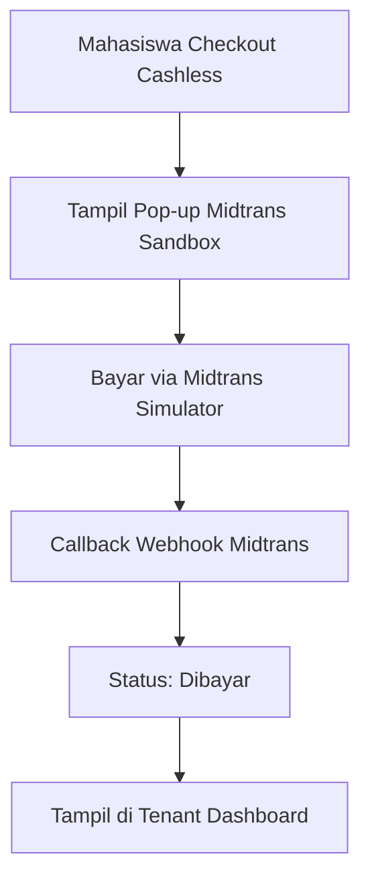
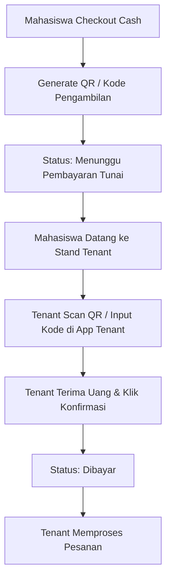
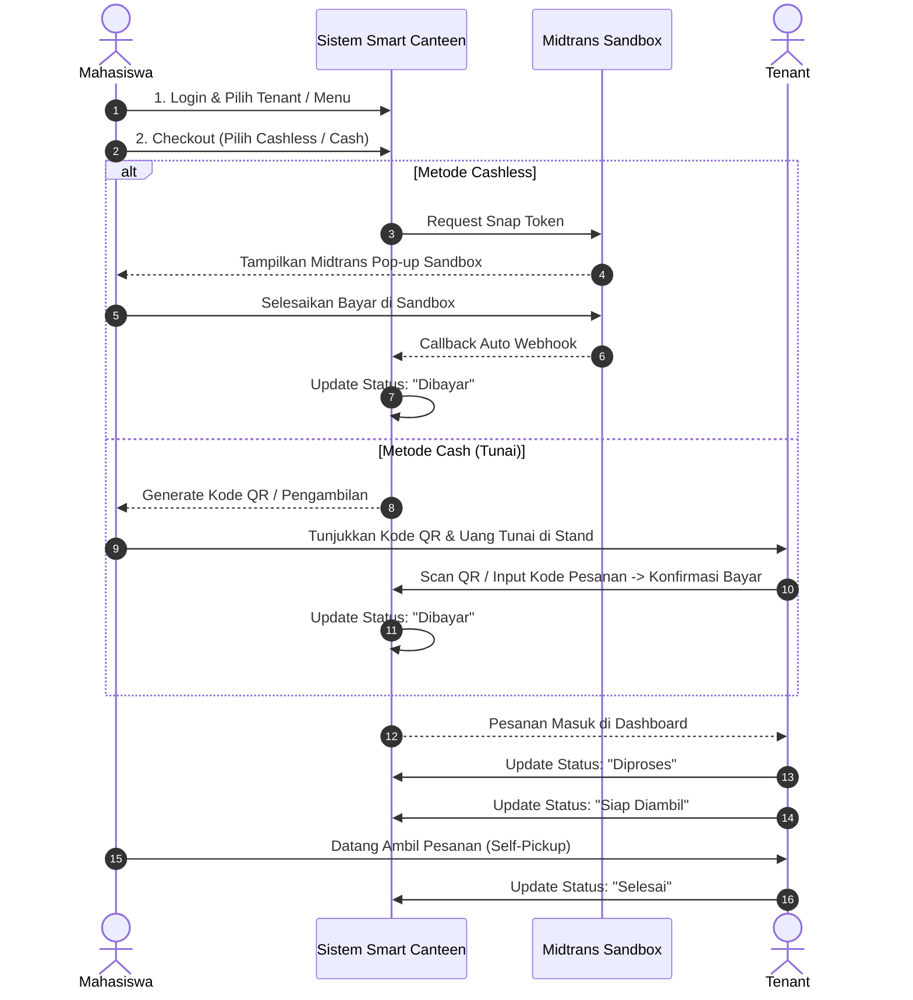

# Project Scope — Smart Canteen FEB

## 1. Informasi Proyek

**Nama Proyek:** Smart Canteen FEB
**Jenis:** Website Dummy / Demo
**Budget:** Rp1.000.000
**Estimasi Pengerjaan:** 5–7 hari kerja

Dokumen ini menjadi **batas utama pengembangan proyek**.

Seluruh implementasi harus mengikuti scope yang tercantum di dokumen ini.

---

## 2. Tujuan Proyek

Smart Canteen FEB adalah website demo yang digunakan untuk memperlihatkan konsep pemesanan makanan/minuman di lingkungan FEB dengan dukungan opsi pembayaran **Cashless (Midtrans Sandbox)** dan **Cash (Tunai dengan Scan QR/Kode oleh Tenant)**, penataan menu ber-kategori, serta keamanan data historis melalui **Soft Deletes**.

Tujuan utama website:

* Menampilkan tenant/kantin.
* Menampilkan menu ber-kategori yang tersedia.
* Memungkinkan mahasiswa membuat pesanan.
* Menampilkan proses checkout (Pilihan **Cashless** vs **Cash**).
* Menampilkan simulasi/alur pembayaran Cashless (Midtrans Sandbox) dan Cash (Scan Kode oleh Tenant).
* Memungkinkan tenant memproses pesanan.
* Menampilkan status pesanan sampai siap diambil.
* Menunjukkan konsep **Self-pickup**.
* Menerapkan **Soft Deletes** pada entity krusial (Users, Tenants, Menus, Orders) untuk integritas riwayat transaksi.

Website ini **BUKAN sistem kantin production**.

Fokus utama adalah **UI, UX, dan demonstrasi alur bisnis utama**.

---

## 3. Aktor Sistem

Sistem hanya memiliki tiga jenis pengguna:

### 3.1 Mahasiswa

Mahasiswa dapat:

* Login / mengakses akun.
* Melihat daftar tenant.
* Melihat menu tenant berdasarkan kategori.
* Melihat detail menu.
* Menambahkan menu ke keranjang.
* Mengubah isi keranjang.
* Melakukan checkout (Pilih **Cashless** atau **Cash**).
* Mendapatkan Kode QR / Kode Pengambilan pesanan.
* Melakukan simulasi pembayaran Cashless atau menampilkan Kode ke Tenant untuk bayar Cash.
* Melihat status pesanan dan tracker timeline.
* Melihat riwayat pesanan.
* Melihat informasi pengambilan pesanan (**Self-Pickup**).

### 3.2 Tenant / Penjual

Tenant dapat:

* Login ke dashboard.
* Melihat pesanan masuk.
* Menampilkan scanner / input kode pesanan untuk **Konfirmasi Pembayaran Cash**.
* Melihat detail pesanan.
* Mengubah status pesanan (`Dibayar` → `Diproses` → `Siap Diambil` → `Selesai`).
* Mengelola kategori menu.
* Menambahkan, mengubah, menghapus menu (dengan **Soft Deletes**).
* Mengatur ketersediaan menu (Toggle Stock).

### 3.3 Admin

Admin dapat:

* Login ke dashboard admin.
* Melihat statistik demo.
* Mengelola data tenant (Tambah, Edit, Hapus via **Soft Deletes**).
* Mengelola pengguna & role (Mahasiswa, Tenant, Admin dengan **Soft Deletes**).
* Melihat & memantau seluruh transaksi kantin.

---

## 4. Scope Pembayaran & Verifikasi

### 4.1 Cashless (Midtrans Sandbox)

### 4.2 Cash (Tunai di Stand Tenant)

---

## 5. Scope Data & Soft Deletes

Data krusial menggunakan fitur **Soft Deletes (`deleted_at`)**:
1. `users`: Jika akun dinonaktifkan/dihapus, riwayat transaksi pesanan historis tetap utuh.
2. `tenants`: Jika tenant tutup/dihapus, riwayat belanja mahasiswa tidak hilang.
3. `menus`: Jika menu dihapus dari katalog tenant, pesanan lama tetap menampilkan nama dan harga menu tersebut (Snapshot Data).
4. `orders`: Pesanan yang dibatalkan/dihapus tetap tersimpan secara soft delete untuk transparansi demo.

---

## 6. Alur Bisnis Utama

Alur utama yang **WAJIB dapat didemokan**:

---

## 7. Definition of Done

Proyek dianggap memenuhi scope apabila:
* Mahasiswa dapat memesan dengan opsi **Cashless** (Midtrans Sandbox) maupun **Cash** (Scan QR oleh Tenant).
* Tenant dapat melakukan **Scan Kode QR / Input Kode** untuk menerima bayar tunai.
* Data `users`, `tenants`, `menus`, dan `orders` menerapkan **Soft Deletes**.
* Menu terkelola dalam **Kategori Menu**.
* Core flow dapat didemonstrasikan dari awal sampai selesai tanpa error.
