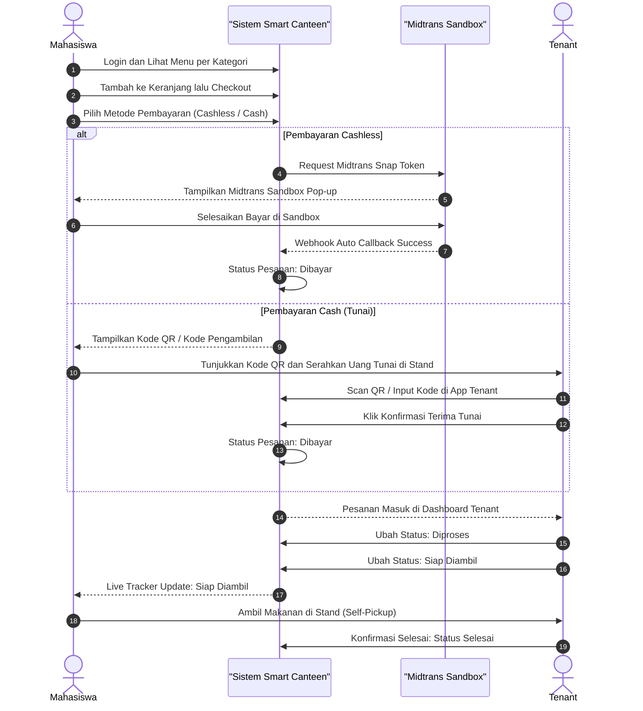
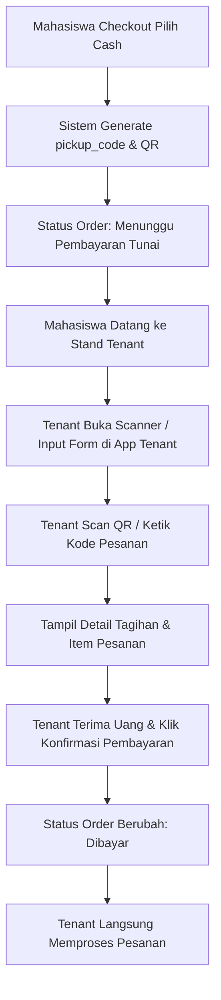

# User Flow — Smart Canteen FEB

## 1. Core End-to-End Business Flow

Alur utama pemesanan dengan opsi **Cashless (Midtrans Sandbox)** dan **Cash (Scan QR / Kode di Tenant)** disajikan dalam diagram Mermaid berikut:

---

## 2. Detail Alur Pembayaran Cash (Scan QR oleh Tenant)

