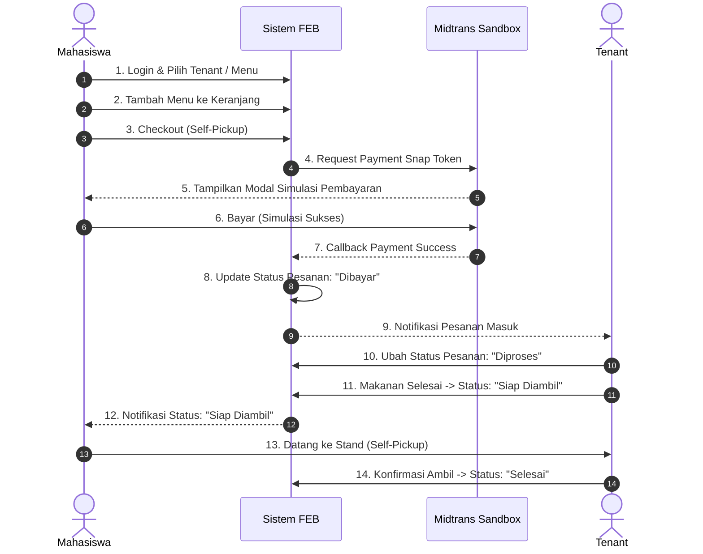
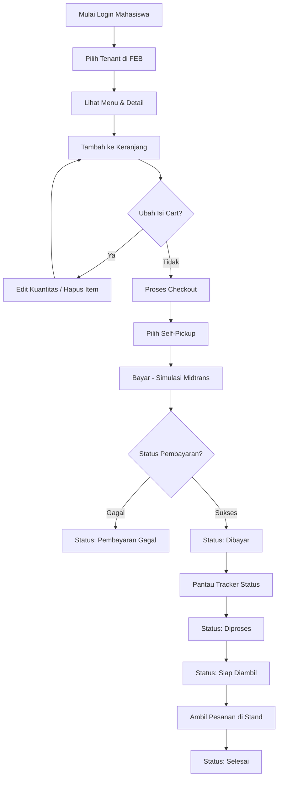
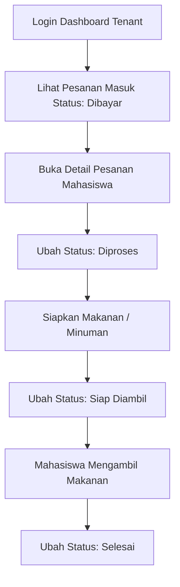
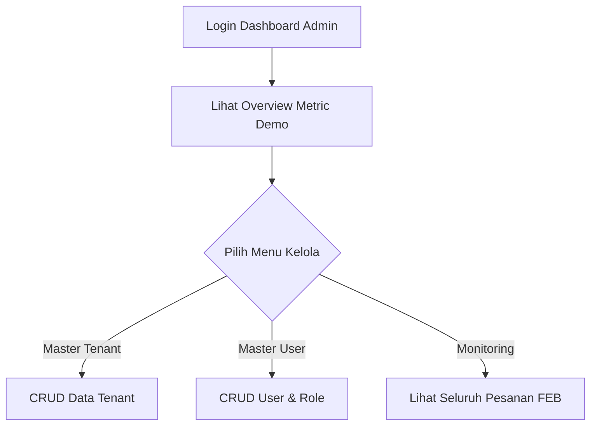

# User Flow — Smart Canteen FEB

## 1. Core End-to-End Business Flow

Alur utama yang **WAJIB dapat didemokan** dari awal hingga selesai disajikan dalam diagram Mermaid berikut:

---

## 2. Alur Detail Berdasarkan Aktor

### 2.1 Alur Mahasiswa

---

### 2.2 Alur Tenant

---

### 2.3 Alur Admin

