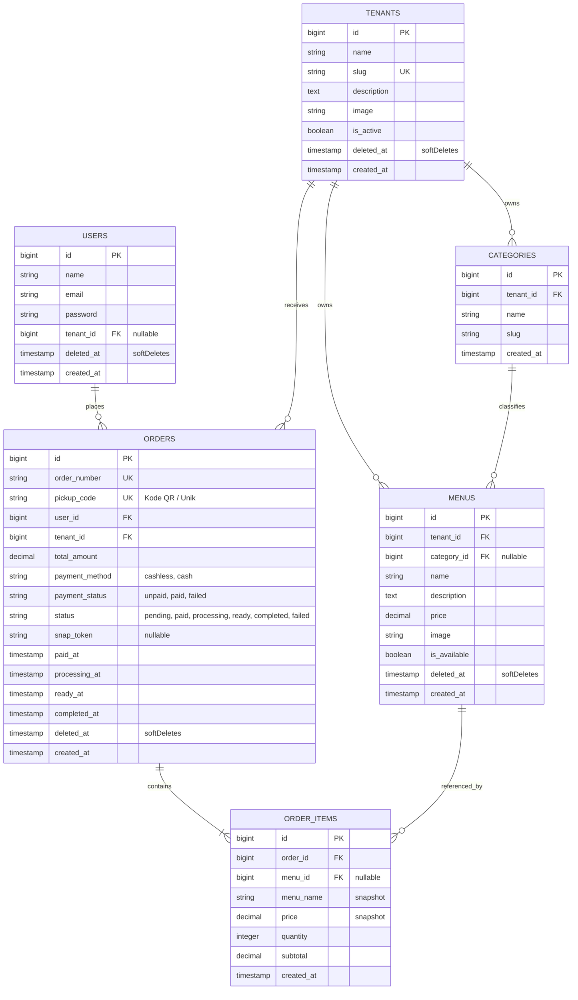

# Data Model & Schema — Smart Canteen FEB

Dokumen ini mendefinisikan struktur basis data lengkap dengan **Soft Deletes**, **Metode Pembayaran Cash vs Cashless**, **Kode QR**, **Kategori Menu**, dan **Snapshot Data**.

---

## 1. Entity Relationship Diagram (ERD)

---

## 2. Table Specifications

### 2.1 `users`
| Column Name | Type | Constraints | Description |
| :--- | :--- | :--- | :--- |
| `id` | BigIncrements | Primary Key | ID Pengguna |
| `name` | String | Not Null | Nama Lengkap |
| `email` | String | Unique, Not Null | Email Pengguna |
| `password` | String | Not Null | Hashed Password |
| `tenant_id` | ForeignId | Nullable, Constrained `tenants` | Relasi ke Tenant |
| `deleted_at` | Timestamp | Nullable | **Soft Delete** |
| `created_at` | Timestamp | Nullable | Waktu dibuat |

---

### 2.2 `tenants`
| Column Name | Type | Constraints | Description |
| :--- | :--- | :--- | :--- |
| `id` | BigIncrements | Primary Key | ID Tenant |
| `name` | String | Not Null | Nama Tenant / Stand |
| `slug` | String | Unique | Slug URL |
| `description` | Text | Nullable | Deskripsi singkat kantin |
| `image` | String | Nullable | Path foto stand/logo |
| `is_active` | Boolean | Default True | Status aktif tenant |
| `deleted_at` | Timestamp | Nullable | **Soft Delete** |
| `created_at` | Timestamp | Nullable | Waktu dibuat |

---

### 2.3 `categories`
| Column Name | Type | Constraints | Description |
| :--- | :--- | :--- | :--- |
| `id` | BigIncrements | Primary Key | ID Kategori |
| `tenant_id` | ForeignId | Constrained `tenants` | Tenant Pemilik |
| `name` | String | Not Null | Nama Kategori (cth: Makanan Utama) |
| `slug` | String | Not Null | Slug Kategori |

---

### 2.4 `menus`
| Column Name | Type | Constraints | Description |
| :--- | :--- | :--- | :--- |
| `id` | BigIncrements | Primary Key | ID Menu |
| `tenant_id` | ForeignId | Constrained `tenants` | Tenant Pemilik |
| `category_id` | ForeignId | Nullable, Constrained `categories` | Kategori Menu |
| `name` | String | Not Null | Nama Makanan / Minuman |
| `description` | Text | Nullable | Deskripsi Menu |
| `price` | Decimal(12,2) | Not Null | Harga per porsi |
| `image` | String | Nullable | Path foto menu |
| `is_available` | Boolean | Default True | Status ketersediaan stok |
| `deleted_at` | Timestamp | Nullable | **Soft Delete** |
| `created_at` | Timestamp | Nullable | Waktu dibuat |

---

### 2.5 `orders`
| Column Name | Type | Constraints | Description |
| :--- | :--- | :--- | :--- |
| `id` | BigIncrements | Primary Key | ID Pesanan |
| `order_number` | String | Unique, Not Null | Kode transaksi unik (cth: `SC-20260918-001`) |
| `pickup_code` | String | Unique, Not Null | Kode QR / String Pengambilan (cth: `FEB-8921`) |
| `user_id` | ForeignId | Constrained `users` | Mahasiswa Pemesan |
| `tenant_id` | ForeignId | Constrained `tenants` | Tenant Tujuan |
| `total_amount` | Decimal(12,2) | Not Null | Total Tagihan Pembayaran |
| `payment_method` | Enum | Default `cashless` | `cashless`, `cash` |
| `payment_status` | Enum | Default `unpaid` | `unpaid`, `paid`, `failed` |
| `status` | Enum | Default `pending` | `pending`, `paid`, `processing`, `ready`, `completed`, `failed` |
| `snap_token` | String | Nullable | Midtrans Snap Token (jika Cashless) |
| `paid_at` | Timestamp | Nullable | Timestamp saat lunas |
| `processing_at` | Timestamp | Nullable | Timestamp mulai diproses |
| `ready_at` | Timestamp | Nullable | Timestamp siap diambil |
| `completed_at` | Timestamp | Nullable | Timestamp selesai diambil |
| `deleted_at` | Timestamp | Nullable | **Soft Delete** |
| `created_at` | Timestamp | Nullable | Waktu dibuat |

---

### 2.6 `order_items`
| Column Name | Type | Constraints | Description |
| :--- | :--- | :--- | :--- |
| `id` | BigIncrements | Primary Key | ID Item Pesanan |
| `order_id` | ForeignId | Constrained `orders`, Cascade | Relasi ke Order |
| `menu_id` | ForeignId | Nullable, Set Null | Relasi ke Menu |
| `menu_name` | String | Not Null | **Snapshot Nama Menu** |
| `price` | Decimal(12,2) | Not Null | **Snapshot Harga Satuan** |
| `quantity` | Integer | Not Null | Jumlah item |
| `subtotal` | Decimal(12,2) | Not Null | Quantity x Price |
