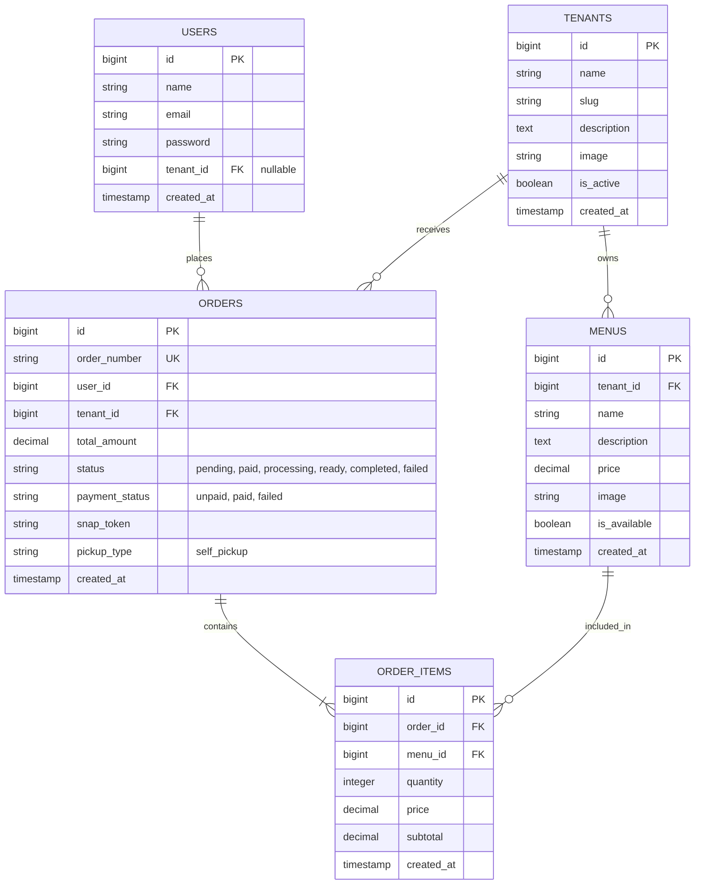

# Data Model & Schema — Smart Canteen FEB

Dokumen ini mendefinisikan struktur basis data minimal yang diperlukan untuk mendukung seluruh fitur scope proyek Smart Canteen FEB.

---

## 1. Entity Relationship Diagram (ERD)

---

## 2. Table Specifications

### 2.1 `users`
Menyimpan data pengguna (Mahasiswa, Tenant Owner, dan Admin).

| Column Name | Type | Constraints | Description |
| :--- | :--- | :--- | :--- |
| `id` | BigIncrements | Primary Key | ID Pengguna |
| `name` | String | Not Null | Nama Lengkap |
| `email` | String | Unique, Not Null | Email Pengguna |
| `password` | String | Not Null | Hashed Password |
| `tenant_id` | ForeignId | Nullable, Constrained `tenants` | Relasi ke Tenant (jika role tenant) |
| `created_at` | Timestamp | Nullable | Waktu dibuat |
| `updated_at` | Timestamp | Nullable | Waktu diubah |

*Note: Pengelolaan role menggunakan Spatie Laravel Permission (`roles` & `model_has_roles`).*

---

### 2.2 `tenants`
Menyimpan data tenant/kantin di lingkungan FEB.

| Column Name | Type | Constraints | Description |
| :--- | :--- | :--- | :--- |
| `id` | BigIncrements | Primary Key | ID Tenant |
| `name` | String | Not Null | Nama Tenant / Stand |
| `slug` | String | Unique | Slug URL |
| `description` | Text | Nullable | Deskripsi singkat kantin |
| `image` | String | Nullable | Path foto stand/logo |
| `is_active` | Boolean | Default True | Status aktif tenant |
| `created_at` | Timestamp | Nullable | Waktu dibuat |
| `updated_at` | Timestamp | Nullable | Waktu diubah |

---

### 2.3 `menus`
Menyimpan data makanan dan minuman yang dijual oleh tenant.

| Column Name | Type | Constraints | Description |
| :--- | :--- | :--- | :--- |
| `id` | BigIncrements | Primary Key | ID Menu |
| `tenant_id` | ForeignId | Constrained `tenants`, Cascade | Id Tenant Pemilik |
| `name` | String | Not Null | Nama Makanan / Minuman |
| `description` | Text | Nullable | Deskripsi Menu |
| `price` | Decimal(12,2) | Not Null | Harga per porsi |
| `image` | String | Nullable | Path foto menu |
| `is_available` | Boolean | Default True | Status ketersediaan (Stok) |
| `created_at` | Timestamp | Nullable | Waktu dibuat |
| `updated_at` | Timestamp | Nullable | Waktu diubah |

---

### 2.4 `orders`
Menyimpan data transaksi pemesanan mahasiswa.

| Column Name | Type | Constraints | Description |
| :--- | :--- | :--- | :--- |
| `id` | BigIncrements | Primary Key | ID Pesanan |
| `order_number` | String | Unique, Not Null | Nomor unik transaksi (cth: `SC-20260918-001`) |
| `user_id` | ForeignId | Constrained `users` | ID Mahasiswa Pemesan |
| `tenant_id` | ForeignId | Constrained `tenants` | ID Tenant Tujuan |
| `total_amount` | Decimal(12,2) | Not Null | Total Tagihan Pembayaran |
| `status` | Enum | Default `pending` | `pending`, `paid`, `processing`, `ready`, `completed`, `failed` |
| `payment_status` | Enum | Default `unpaid` | `unpaid`, `paid`, `failed` |
| `snap_token` | String | Nullable | Midtrans Snap Token untuk Demo |
| `pickup_type` | String | Default `self_pickup` | Metode pengambilan (Self-Pickup) |
| `created_at` | Timestamp | Nullable | Waktu dibuat |
| `updated_at` | Timestamp | Nullable | Waktu diubah |

---

### 2.5 `order_items`
Menyimpan detail rincian menu yang dibeli dalam satu order.

| Column Name | Type | Constraints | Description |
| :--- | :--- | :--- | :--- |
| `id` | BigIncrements | Primary Key | ID Item Pesanan |
| `order_id` | ForeignId | Constrained `orders`, Cascade | ID Pesanan |
| `menu_id` | ForeignId | Constrained `menus` | ID Menu yang dibeli |
| `quantity` | Integer | Not Null | Jumlah item |
| `price` | Decimal(12,2) | Not Null | Harga satuan saat transaksi |
| `subtotal` | Decimal(12,2) | Not Null | Total (Quantity x Price) |
| `created_at` | Timestamp | Nullable | Waktu dibuat |
| `updated_at` | Timestamp | Nullable | Waktu diubah |
