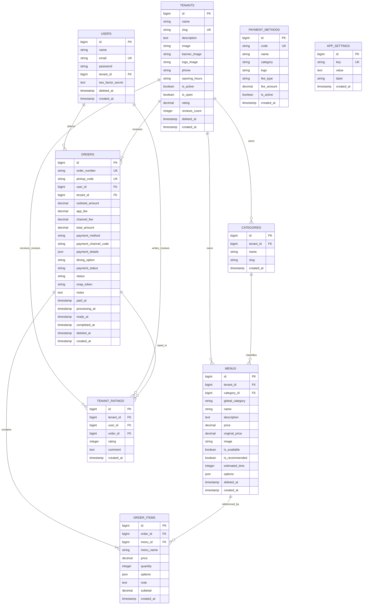

# Data Model & Schema — Smart Canteen FEB

Dokumen ini mendefinisikan struktur basis data lengkap yang disesuaikan dengan seluruh **skema migrasi database aktif**, termasuk **Soft Deletes**, **Metode Pembayaran Cash vs Cashless**, **Kode QR**, **Kategori Tenant & Global**, **Rating & Ulasan**, **Pengaturan Aplikasi**, dan **Snapshot Data Pesanan**.

---

## 1. Entity Relationship Diagram (ERD)

---

## 2. Table Specifications

### 2.1 `users`
| Column Name | Type | Constraints | Description |
| :--- | :--- | :--- | :--- |
| `id` | BigIncrements | Primary Key | ID Pengguna |
| `name` | String | Not Null | Nama Lengkap Pengguna |
| `email` | String | Unique, Not Null | Email Pengguna |
| `email_verified_at` | Timestamp | Nullable | Timestamp Verifikasi Email |
| `password` | String | Not Null | Hashed Password |
| `tenant_id` | ForeignId | Nullable, Constrained `tenants` | Relasi ke Stand (jika role Tenant) |
| `two_factor_secret` | Text | Nullable | Rahasia OTP 2FA |
| `two_factor_recovery_codes` | Text | Nullable | Kode Pemulihan 2FA |
| `two_factor_confirmed_at` | Timestamp | Nullable | Timestamp Konfirmasi 2FA |
| `remember_token` | String | Nullable | Token Sesi Login |
| `deleted_at` | Timestamp | Nullable | **Soft Delete** |
| `created_at`, `updated_at` | Timestamp | Nullable | Audit Timestamps |

---

### 2.2 `tenants`
| Column Name | Type | Constraints | Description |
| :--- | :--- | :--- | :--- |
| `id` | BigIncrements | Primary Key | ID Stand Kantin |
| `name` | String | Not Null | Nama Stand / Kantin |
| `slug` | String | Unique, Not Null | Slug URL (cth: `kantin-pak-kumis`) |
| `description` | Text | Nullable | Deskripsi Singkat Stand |
| `image` | String | Nullable | Foto Utama Stand |
| `banner_image` | String | Nullable | Gambar Banner Header Stand |
| `logo_image` | String | Nullable | Gambar Logo Stand |
| `phone` | String | Nullable | Nomor Telepon / WA Stand |
| `opening_hours` | String | Default `08:00 - 17:00` | Jam Operasional Stand |
| `is_active` | Boolean | Default `true` | Status Aktif Sistem |
| `is_open` | Boolean | Default `true` | Status Buka / Tutup Stand |
| `rating` | Decimal(3,2) | Default `5.00` | Rata-rata Bintang Rating (1.00 - 5.00) |
| `reviews_count` | UnsignedInt | Default `0` | Total Jumlah Ulasan Pembeli |
| `deleted_at` | Timestamp | Nullable | **Soft Delete** |
| `created_at`, `updated_at` | Timestamp | Nullable | Audit Timestamps |

---

### 2.3 `categories`
| Column Name | Type | Constraints | Description |
| :--- | :--- | :--- | :--- |
| `id` | BigIncrements | Primary Key | ID Kategori Internal Tenant |
| `tenant_id` | ForeignId | Constrained `tenants`, Cascade | Stand Pemilik Kategori |
| `name` | String | Not Null | Nama Kategori (cth: *Makanan Utama*) |
| `slug` | String | Not Null | Slug Kategori |
| `created_at`, `updated_at` | Timestamp | Nullable | Audit Timestamps |

*Unique Constraint*: `['tenant_id', 'slug']`

---

### 2.4 `menus`
| Column Name | Type | Constraints | Description |
| :--- | :--- | :--- | :--- |
| `id` | BigIncrements | Primary Key | ID Menu Makanan/Minuman |
| `tenant_id` | ForeignId | Constrained `tenants`, Cascade | Stand Pemilik Menu |
| `category_id` | ForeignId | Nullable, Constrained `categories` | Kategori Internal Tenant |
| `global_category` | String | Default `makanan` | Kategori Global (`makanan`, `minuman`, `camilan`) |
| `name` | String | Not Null | Nama Hidangan |
| `description` | Text | Nullable | Deskripsi & Komposisi Menu |
| `price` | Decimal(12,2) | Not Null | Harga Jual Satuan (Rp) |
| `original_price` | Decimal(12,2) | Nullable | Harga Asli Sebelum Diskon (Rp) |
| `image` | String | Nullable | Path Foto Menu |
| `is_available` | Boolean | Default `true` | Status Ketersediaan Stok (*Available/Out of Stock*) |
| `is_recommended` | Boolean | Default `false` | Tag Menu Rekomendasi / *Best Seller* |
| `estimated_time` | Integer | Default `15` | Estimasi Waktu Penyajian (Menit) |
| `options` | JSON | Nullable | Opsi Varian Hidangan (Toping, Level Pedas) |
| `deleted_at` | Timestamp | Nullable | **Soft Delete** |
| `created_at`, `updated_at` | Timestamp | Nullable | Audit Timestamps |

---

### 2.5 `orders`
| Column Name | Type | Constraints | Description |
| :--- | :--- | :--- | :--- |
| `id` | BigIncrements | Primary Key | ID Transaksi Pesanan |
| `order_number` | String | Unique, Not Null | Kode Transaksi Unik (cth: `SC-20260920-001`) |
| `pickup_code` | String | Unique, Not Null | Kode QR / String Pengambilan (cth: `FEB-8921`) |
| `user_id` | ForeignId | Constrained `users`, Cascade | Mahasiswa Pemesan |
| `tenant_id` | ForeignId | Constrained `tenants`, Cascade | Stand Tujuan Pesanan |
| `subtotal_amount` | Decimal(12,2) | Default `0.00` | Subtotal Harga Seluruh Item (Rp) |
| `app_fee` | Decimal(12,2) | Default `0.00` | Biaya Layanan Aplikasi (Rp) |
| `channel_fee` | Decimal(12,2) | Default `0.00` | Biaya Gateway Pembayaran (Rp) |
| `total_amount` | Decimal(12,2) | Not Null | Total Tagihan Akhir Lunas (Rp) |
| `payment_method` | String | Default `cashless` | Metode Utama (`cashless`, `cash`) |
| `payment_channel_code` | String | Nullable | Kode Saluran Bayar (cth: `bca_va`, `qris`, `cash`) |
| `payment_details` | JSON | Nullable | Simulasi Detail Pembayaran Midtrans / QR |
| `dining_option` | String | Default `dine_in` | Opsi Santap (`dine_in`, `takeaway`) |
| `payment_status` | String | Default `unpaid` | Status Bayar (`unpaid`, `paid`, `failed`) |
| `status` | String | Default `pending` | Status Alur (`pending`, `paid`, `processing`, `ready`, `completed`, `failed`) |
| `snap_token` | String | Nullable | Token Snap Midtrans |
| `notes` | Text | Nullable | Catatan Keseluruhan Pesanan |
| `paid_at` | Timestamp | Nullable | Timestamp Pembayaran Lunas |
| `processing_at` | Timestamp | Nullable | Timestamp Mulai Diproses Penjual |
| `ready_at` | Timestamp | Nullable | Timestamp Siap Di-pickup |
| `completed_at` | Timestamp | Nullable | Timestamp Selesai Di-pickup |
| `deleted_at` | Timestamp | Nullable | **Soft Delete** |
| `created_at`, `updated_at` | Timestamp | Nullable | Audit Timestamps |

---

### 2.6 `order_items`
| Column Name | Type | Constraints | Description |
| :--- | :--- | :--- | :--- |
| `id` | BigIncrements | Primary Key | ID Item Pesanan |
| `order_id` | ForeignId | Constrained `orders`, Cascade | Relasi ke Order |
| `menu_id` | ForeignId | Nullable, Set Null | Relasi ke Menu |
| `menu_name` | String | Not Null | **Snapshot Nama Menu** |
| `price` | Decimal(12,2) | Not Null | **Snapshot Harga Satuan** |
| `quantity` | UnsignedInt | Not Null | Jumlah Porsi yang Dipesan |
| `options` | JSON | Nullable | **Snapshot Opsi Varian yang Dipilih** |
| `note` | Text | Nullable | Catatan Khusus Item Makanan |
| `subtotal` | Decimal(12,2) | Not Null | Subtotal (`quantity` x `price`) |
| `created_at`, `updated_at` | Timestamp | Nullable | Audit Timestamps |

---

### 2.7 `tenant_ratings`
| Column Name | Type | Constraints | Description |
| :--- | :--- | :--- | :--- |
| `id` | BigIncrements | Primary Key | ID Ulasan & Rating |
| `tenant_id` | ForeignId | Constrained `tenants`, Cascade | Stand Penerima Ulasan |
| `user_id` | ForeignId | Constrained `users`, Cascade | Pembuat Ulasan (Mahasiswa) |
| `order_id` | ForeignId | Nullable, Set Null | Pesanan yang Diulas |
| `rating` | UnsignedTinyInt | Default `5` | Nilai Bintang Rating (1 - 5 ⭐) |
| `comment` | Text | Nullable | Teks Ulasan / Kesan Pembeli |
| `created_at`, `updated_at` | Timestamp | Nullable | Audit Timestamps |

---

### 2.8 `payment_methods`
| Column Name | Type | Constraints | Description |
| :--- | :--- | :--- | :--- |
| `id` | BigIncrements | Primary Key | ID Metode Pembayaran |
| `code` | String | Unique, Not Null | Kode Unik (cth: `bca_va`, `qris`, `cash`) |
| `name` | String | Not Null | Nama Tampilan (cth: *BCA Virtual Account*) |
| `category` | Enum | Default `bank_transfer` | Kategori (`bank_transfer`, `ewallet`) |
| `logo` | String | Nullable | Path Icon / Logo Saluran |
| `fee_type` | Enum | Default `fixed` | Tipe Biaya Penanganan (`fixed`, `percentage`) |
| `fee_amount` | Decimal(10,2) | Default `0.00` | Besaran Biaya Admin (Rp / %) |
| `is_active` | Boolean | Default `false` | Status Aktif Saluran Pembayaran |
| `created_at`, `updated_at` | Timestamp | Nullable | Audit Timestamps |

---

### 2.9 `app_settings`
| Column Name | Type | Constraints | Description |
| :--- | :--- | :--- | :--- |
| `id` | BigIncrements | Primary Key | ID Pengaturan Aplikasi |
| `key` | String | Unique, Not Null | Kunci Pengaturan (cth: `app_fee`, `midtrans_sandbox`) |
| `value` | Text | Nullable | Nilai Konfigurasi |
| `label` | String | Nullable | Label Keterangan Pengaturan |
| `created_at`, `updated_at` | Timestamp | Nullable | Audit Timestamps |
