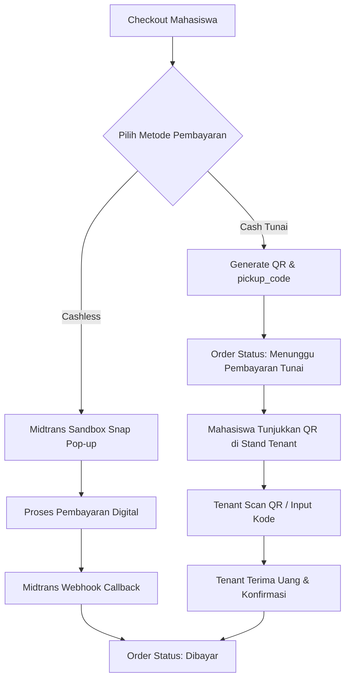

# Payment Flow & Verification — Smart Canteen FEB

## 1. Dual Payment System Overview

Smart Canteen FEB mendukung 2 metode pembayaran:
1. **Cashless (Midtrans Sandbox):** Pembayaran digital otomatis dengan verifikasi HTTP callback.
2. **Cash (Tunai):** Pembayaran tunai langsung di stand tenant menggunakan **Scan Kode QR / Input Kode Pesanan**.

---

## 2. Alur Pembayaran Cashless (Midtrans Sandbox)

1. Mahasiswa mengklik "Bayar Sekarang" dengan opsi Cashless.
2. Backend me-request Midtrans Snap Token via Midtrans Sandbox API.
3. Midtrans Snap Modal muncul di layar Mahasiswa.
4. Untuk pengujian di lingkungan **Sandbox**:
   - **Saran Utama (BCA Virtual Account)**: [https://simulator.sandbox.midtrans.com/bca/va/index](https://simulator.sandbox.midtrans.com/bca/va/index) *(Praktis: Cukup salin Nomor VA dari Snap tanpa menyalin URL gambar QR)*.
   - **Alternatif (QRIS)**: [https://simulator.sandbox.midtrans.com/v2/qris/index](https://simulator.sandbox.midtrans.com/v2/qris/index).
5. Setelah transaksi dilakukan di Midtrans Simulator, Midtrans mengirimkan HTTP POST Callback Webhook ke `/api/midtrans/notification`.
6. System mengecek signature key dan mengubah status `orders`:
   - `status = 'paid'`, `payment_status = 'paid'`, `paid_at = now()`.

---

## 3. Alur Pembayaran Cash (Scan Kode QR oleh Tenant)

1. Mahasiswa memilih opsi **Cash / Tunai**.
2. System membuat pesanan dengan `payment_method = 'cash'`, `payment_status = 'unpaid'`, dan menghasilkan `pickup_code` unik (cth: `FEB-9912`) & QR Code string.
3. Mahasiswa mendatangi stand tenant di kantin FEB dan menunjukkan Kode QR pada HP-nya.
4. Tenant membuka modal **Scan / Verifikasi Pembayaran Cash** di aplikasi Tenant.
5. Tenant melakukan scan QR via kamera atau mengetik `FEB-9912`.
6. Aplikasi menampilkan rincian tagihan (cth: 2 Nasi Goreng + 1 Es Teh = Rp25.000).
7. Tenant menerima uang fisik dari mahasiswa, lalu mengklik tombol **"Konfirmasi Terima Pembayaran Tunai"**.
8. Backend memperbarui status pesanan: `status = 'paid'`, `payment_status = 'paid'`, `paid_at = now()`.
