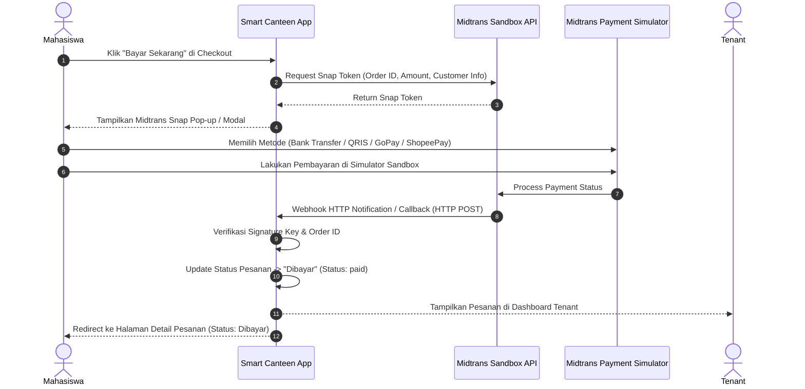
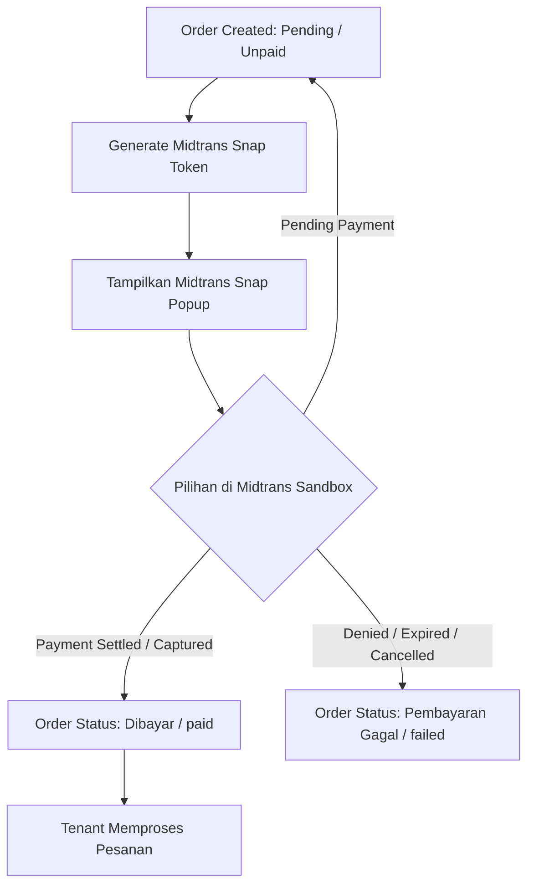

# Payment Flow & Midtrans Sandbox Integration — Smart Canteen FEB

## 1. Midtrans Sandbox Integration Overview

Sesuai dengan section 4.8 pada [01-scope.md](file:///home/darbi/Projects/smart_canteen/docs/01-scope.md), fitur pembayaran pada Smart Canteen FEB menggunakan **Midtrans Sandbox (Mode Testing)** untuk mendemonstrasikan alur pembayaran nyata secara langsung.



---

## 2. Alur Status Pembayaran (Payment State Machine)

Diagram transisi status transaksi Midtrans Sandbox disajikan dalam Mermaid flowchart berikut:



---

## 3. Konfigurasi Midtrans Sandbox (Environment Variables)

File `.env` aplikasi dikonfigurasi menggunakan kredensial Sandbox Midtrans:

```env
MIDTRANS_SERVER_KEY=SB-Mid-server-YOUR_SANDBOX_SERVER_KEY
MIDTRANS_CLIENT_KEY=SB-Mid-client-YOUR_SANDBOX_CLIENT_KEY
MIDTRANS_IS_PRODUCTION=false
MIDTRANS_IS_SANITIZED=true
MIDTRANS_IS_3DS=true
```

---

## 4. Webhook Notification & Verifikasi HTTP Callback

Handler endpoint (`/api/midtrans/notification`):
1. Menerima payload JSON dari Midtrans Sandbox (`order_id`, `transaction_status`, `fraud_status`, `gross_amount`, `signature_key`).
2. Melakukan verifikasi `signature_key`:
   $$\text{SHA512}(\text{order\_id} + \text{status\_code} + \text{gross\_amount} + \text{ServerKey})$$
3. Jika valid:
   - Status `settlement` / `capture` $\rightarrow$ set `orders.status = 'paid'`, `orders.payment_status = 'paid'`.
   - Status `deny` / `cancel` / `expire` $\rightarrow$ set `orders.status = 'failed'`, `orders.payment_status = 'failed'`.
