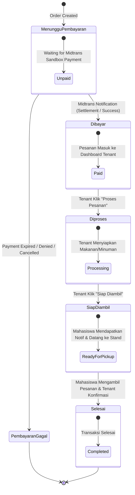
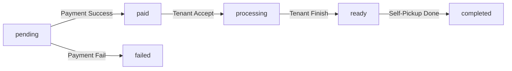

# Order Status Machine — Smart Canteen FEB

## 1. State Machine Order Status

Status pesanan pada Smart Canteen FEB mengontrol alur dari awal pembuatan pesanan oleh Mahasiswa hingga siap diambil melalui mekanisme **Self-Pickup** di stand kantin FEB.

Seluruh status pesanan dan alur transisinya divisualisasikan menggunakan diagram Mermaid berikut:

---

## 2. Deskripsi Setiap Status

| Status Code | Label UI | Aktor Pengubah Status | Keterangan Business Flow |
| :--- | :--- | :--- | :--- |
| `pending` | **Menunggu Pembayaran** | System | Order dibuat oleh Mahasiswa, menunggu penyelesaian pembayaran di Midtrans Sandbox. |
| `paid` | **Dibayar** | Midtrans Callback | Pembayaran berhasil dikonfirmasi Midtrans, pesanan tampil di tab Pesanan Masuk Tenant. |
| `processing` | **Diproses** | Tenant | Tenant mulai memasak / menyiapkan makanan & minuman. |
| `ready` | **Siap Diambil** | Tenant | Makanan telah siap di stand, Mahasiswa datang untuk **Self-Pickup**. |
| `completed` | **Selesai** | Tenant / Mahasiswa | Mahasiswa mengambil makanan di stand kantin FEB, transaksi ditutup. |
| `failed` | **Pembayaran Gagal** | Midtrans Callback | Pembayaran dibatalkan, ditolak, atau kadaluarsa di Midtrans Sandbox. |

---

## 3. Matriks Perubahan Status (Allowed Transitions)

