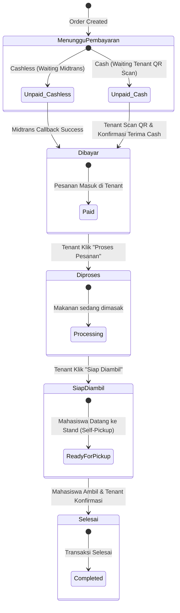

# Order Status Machine — Smart Canteen FEB

## 1. State Machine Order Status

Status pesanan pada Smart Canteen FEB mengontrol alur dari awal pembuatan pesanan hingga siap diambil melalui mekanisme **Self-Pickup**.

---

## 2. Status & Timestamps Audit Matrix

| Status | Label UI | Trigger Cashless | Trigger Cash | Updated Timestamp |
| :--- | :--- | :--- | :--- | :--- |
| `pending` | **Menunggu Pembayaran** | Order Created | Order Created | `created_at` |
| `paid` | **Dibayar** | Midtrans Webhook Callback | Tenant Scan QR & Confirm | `paid_at` |
| `processing` | **Diproses** | Tenant Action | Tenant Action | `processing_at` |
| `ready` | **Siap Diambil** | Tenant Action | Tenant Action | `ready_at` |
| `completed` | **Selesai** | Tenant / Mahasiswa Action | Tenant / Mahasiswa Action | `completed_at` |
| `failed` | **Gagal** | Midtrans Expired/Denied | Tenant Cancel | - |
