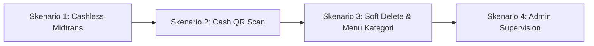

# Demo Scenarios — Smart Canteen FEB

Dokumen ini berisi langkah-langkah pengujian (Walkthrough Test Script) untuk mendemonstrasikan sistem Smart Canteen FEB kepada penguji / stakeholder.

---

## 1. Demo Scenarios Flow

---

## 2. Langkah-Langkah Skenario Demo

### Skenario 1: Pemesanan Cashless (Midtrans Sandbox)
1. Mahasiswa login (`mahasiswa@feb.ac.id`), pilih Tenant & Menu.
2. Tambahkan ke keranjang $\rightarrow$ Checkout $\rightarrow$ Pilih **Cashless**.
3. Selesaikan pembayaran di Pop-up Midtrans Sandbox.
4. Status otomatis ter-update menjadi **"Dibayar"** dan pesanan muncul di Dashboard Tenant.

### Skenario 2: Pemesanan Cash (Scan QR oleh Tenant)
1. Mahasiswa buat pesanan baru $\rightarrow$ Checkout $\rightarrow$ Pilih **Cash / Tunai**.
2. Aplikasi menampilkan **Kode QR & Pickup Code** (cth: `FEB-8821`).
3. Pada tab Tenant (`tenant@feb.ac.id`), buka **Scan QR / Input Kode Pembayaran**.
4. Scan / ketik `FEB-8821` $\rightarrow$ Klik **Konfirmasi Terima Pembayaran Tunai**.
5. Status otomatis berubah menjadi **"Dibayar"** $\rightarrow$ Tenant memproses pesanan hingga **"Siap Diambil"** $\rightarrow$ **"Selesai"**.

### Skenario 3: Demonstrasi Soft Delete & Kategori Menu
1. Tenant menambah/menghapus menu ber-kategori.
2. Saat menu di-soft delete, riwayat pesanan lama mahasiswa **tetap aman dan konsisten** karena menggunakan snapshot & SoftDeletes.

### Skenario 4: Admin Supervision
1. Admin login (`admin@feb.ac.id`), memantau rasio pembayaran Cash vs Cashless dan kelola data master (Tenant & User dengan Soft Delete).
