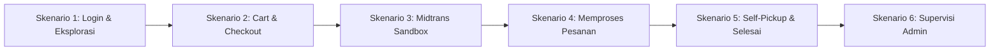

# Demo Scenarios — Smart Canteen FEB

Dokumen ini berisi langkah-langkah pengujian (Walkthrough Test Script) untuk mendemonstrasikan sistem Smart Canteen FEB kepada penguji / stakeholder.

---

## 1. Demo Flow Overview

---

## 2. Langkah-Langkah Skenario Demo

### Skenario 1: Login & Eksplorasi Menu (Mahasiswa)
1. Buka aplikasi di browser (`http://localhost:8000`).
2. Login sebagai Mahasiswa (`mahasiswa@feb.ac.id` / `password`).
3. Pilih salah satu Tenant (misal: "Kantin Bu Sri").
4. Lihat daftar menu makanan & minuman. Klik salah satu menu untuk melihat modal detail menu.

### Skenario 2: Pemesanan & Checkout (Mahasiswa)
1. Atur kuantitas (misal: 2 Nasi Goreng, 1 Es Teh Manis).
2. Klik **"Tambah ke Keranjang"**.
3. Buka halaman Keranjang (`/cart`), sesuaikan kuantitas.
4. Klik **"Checkout"**.
5. Verifikasi informasi **Self-Pickup di Stand Kantin FEB** dan total pembayaran.

### Skenario 3: Simulasi Pembayaran Midtrans Sandbox
1. Klik tombol **"Bayar Sekarang"**.
2. Modal Midtrans Snap Sandbox akan muncul.
3. Pilih metode pembayaran (misal: QRIS / Virtual Account BCA Sandbox).
4. Selesaikan pembayaran pada simulator Midtrans Sandbox.
5. Halaman otomatis meredirect ke Detail Pesanan dengan badge status **"Dibayar"**.

### Skenario 4: Memproses Pesanan (Tenant)
1. Buka browser baru / incognito tab, login sebagai Tenant (`tenant@feb.ac.id` / `password`).
2. Masuk ke **Dashboard Tenant** -> Tab **Pesanan Masuk**.
3. Tinjau rincian pesanan baru dari Mahasiswa.
4. Klik tombol **"Proses Pesanan"** (Status berubah menjadi **"Diproses"**).
5. Setelah makanan siap, klik tombol **"Siap Diambil"** (Status berubah menjadi **"Siap Diambil"**).

### Skenario 5: Pengambilan Pesanan / Self-Pickup (Mahasiswa & Tenant)
1. Pada tab Mahasiswa, perhatikan status tracker otomatis berubah menjadi **"Siap Diambil"**.
2. Mahasiswa mendatangi stand kantin FEB.
3. Tenant mengklik **"Selesaikan Pesanan"** saat makanan diserahkan.
4. Status berubah menjadi **"Selesai"**.

### Skenario 6: Supervisi Admin (Admin)
1. Login sebagai Admin (`admin@feb.ac.id` / `password`).
2. Buka **Dashboard Admin** untuk memperlihatkan statistik total transaksi demo, data tenant, dan data pengguna.
