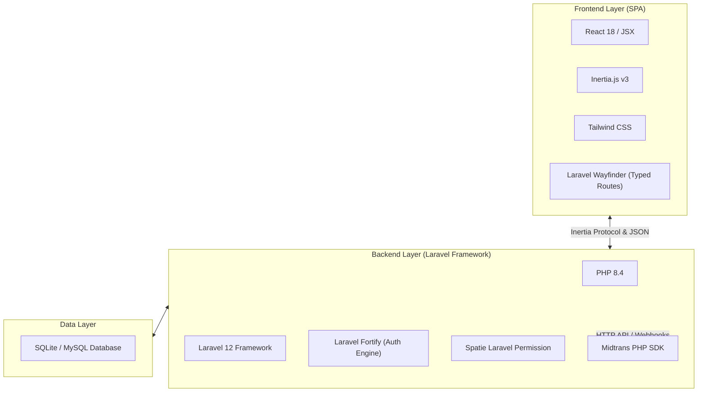

# Technical Guidelines — Smart Canteen FEB

Dokumen ini mendefinisikan arsitektur teknis, stack teknologi, konvensi kode, dan panduan pengembangan aplikasi Smart Canteen FEB.

---

## 1. Stack Teknologi



---

## 2. Dependensi Utama (Composer & NPM)

### PHP Packages (Composer)
* `laravel/framework`: ^12.0
* `inertiajs/inertia-laravel`: ^2.0 / v3
* `laravel/fortify`: Authentication backend
* `spatie/laravel-permission`: ^8.3 (Manajemen Role & Permisi)
* `midtrans/midtrans-php`: Integrasi SDK Pembayaran Midtrans Sandbox
* `laravel/wayfinder`: Auto-generate TypeScript/JS routes

### JS Packages (NPM)
* `@inertiajs/react`: Interaksi Client-side React dengan Inertia
* `react` & `react-dom`: Library UI Rendering
* `tailwindcss` & `@tailwindcss/vite`: Utility-first CSS styling

---

## 3. Struktur Direktori & Konvensi Kode

* **Controller:** Disimpan di `app/Http/Controllers/`. Controller harus tipis (slim controllers), mengembalikan `Inertia::render('PageName', $props)`.
* **Model:** Disimpan di `app/Models/`. Menggunakan Laravel Eloquent dengan typehints PHP 8.4.
* **React Pages:** Disimpan di `resources/js/pages/`.
  - `resources/js/pages/Mahasiswa/`: Halaman khusus flow mahasiswa.
  - `resources/js/pages/Tenant/`: Halaman dashboard & pesanan tenant.
  - `resources/js/pages/Admin/`: Halaman dashboard & master data admin.
* **Components:** Component reusable disimpan di `resources/js/components/`.

---

## 4. Perintah Utama Development

```bash
# Menjalankan server backend Laravel
php artisan serve

# Menjalankan Vite dev server frontend
npm run dev

# Format kode PHP otomatis
vendor/bin/pint --format agent

# Regenerate Wayfinder typed routes
php artisan wayfinder:generate
```
