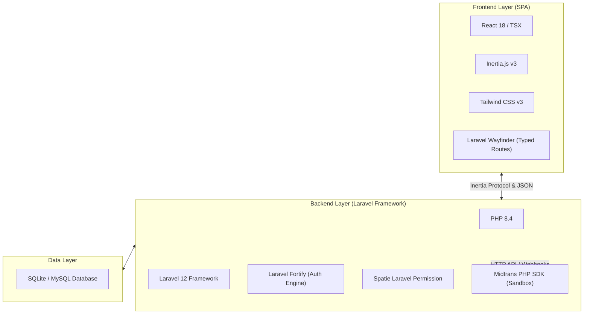

# Technical Guidelines — Smart Canteen FEB

Dokumen ini mendefinisikan arsitektur teknis, stack teknologi, konvensi kode, dan panduan pengembangan aplikasi Smart Canteen FEB.

---

## 1. Stack Teknologi



---

## 2. Dependensi Utama (Composer & NPM)

### PHP Packages (Composer)
* `laravel/framework`: ^12.0
* `inertiajs/inertia-laravel`: ^2.0 / v3
* `laravel/fortify`: Authentication backend (Login, Register, 2FA, Password Reset)
* `spatie/laravel-permission`: ^8.3 (Manajemen Role: *Mahasiswa*, *Tenant*, *Admin*)
* `midtrans/midtrans-php`: Integrasi SDK Pembayaran Midtrans Gateway
* `laravel/wayfinder`: Auto-generate TypeScript/JS route actions

### JS Packages (NPM)
* `@inertiajs/react`: Interaksi Client-side React dengan Inertia
* `react` & `react-dom`: Library UI Rendering
* `tailwindcss`: Utility-first CSS styling
* `lucide-react`: Icon Set Modern
* `recharts`: Library Grafik Chart Metrik Dashboard

---

## 3. Struktur Direktori Utama

```
smart_canteen/
├── app/
│   ├── Actions/Fortify/        # Custom Fortify Auth Actions
│   ├── Enums/                  # PHP 8.4 Enums (UserRole, OrderStatus, etc.)
│   ├── Http/
│   │   ├── Controllers/
│   │   │   ├── Admin/          # Controller Modul Admin
│   │   │   ├── Customer/       # Controller Modul Mahasiswa
│   │   │   ├── Tenant/         # Controller Modul Tenant
│   │   │   └── Api/            # Webhook & API Handlers
│   ├── Models/                 # Eloquent Models dengan SoftDeletes
│   └── Services/               # Service Classes (MidtransService, etc.)
├── database/
│   ├── migrations/             # Migrasi Database
│   └── seeders/                # Database Seeders
├── docs/                       # Dokumentasi Teknis & Panduan Pengguna
└── resources/
    └── js/
        ├── components/         # Reusable UI Components
        ├── layouts/            # Layout Components (StudentLayout, SettingsLayout, etc.)
        └── pages/              # Inertia React Pages
            ├── admin/          # Dashboard & Master Data Admin
            ├── auth/           # Login, Register, 2FA Pages
            ├── catalog/        # Katalog Utama & Cart
            ├── orders/         # Tracker, Payment & History
            ├── settings/       # Profile & Security Settings
            └── tenant/         # Dashboard & Order Board Tenant
```

---

## 4. Perintah Utama Development

```bash
# Menjalankan server backend Laravel
php artisan serve

# Menjalankan Vite dev server frontend
npm run dev

# Format kode PHP otomatis sesuai standar Pint
vendor/bin/pint --format agent

# Regenerate Wayfinder typed routes
php artisan wayfinder:generate

# Menjalankan seluruh pengujian Pest / PHPUnit
php artisan test --compact
```
