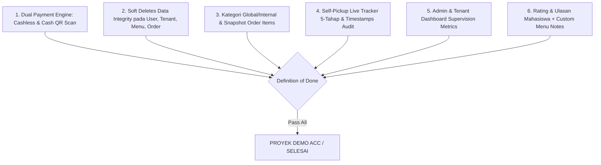

# Acceptance Criteria — Smart Canteen FEB

## 1. Quality Gate Overview

---

## 2. Checklist Acceptance Criteria

* [x] Mahasiswa dapat melakukan checkout dengan metode pembayaran **Cashless** (Midtrans Sandbox via BCA VA/QRIS) maupun **Cash** (Tunai di Stand).
* [x] Mahasiswa menerima Kode QR & string `pickup_code` unik (format `FEB-XXXX`) untuk transaksi pembayaran tunai & self-pickup.
* [x] Tenant memiliki fitur **Scan Kode QR Kamera / Input Kode Manual** pada `/tenant/verify-payment` untuk mengonfirmasi pembayaran tunai.
* [x] Model `User`, `Tenant`, `Menu`, dan `Order` mengimplementasikan Trait `SoftDeletes` (`deleted_at`) sehingga riwayat transaksi historis tetap utuh 100%.
* [x] Model `OrderItem` menyimpan `menu_name`, `price`, `options`, dan `note` sebagai snapshot data saat transaksi dibuat.
* [x] Tenant dapat mengelompokkan menu berdasarkan `Category` internal stand, dan menu terhubung dengan `global_category` (*makanan, minuman, camilan*).
* [x] Status pesanan meng-update timestamp audit secara otomatis (`paid_at`, `processing_at`, `ready_at`, `completed_at`).
* [x] Tenant dapat mengoperasikan saklar *Status Buka/Tutup Stand* (`is_open`) dan saklar *Stok Instant* (*Available/Out of Stock*).
* [x] Mahasiswa dapat memberikan rating bintang 1–5 ⭐ dan ulasan teks setelah pesanan di-pickup.
* [x] Admin dapat memantau statistik total omset kantin, mengelola master tenant & user, serta mengatur biaya layanan aplikasi (*Admin Fee*).
