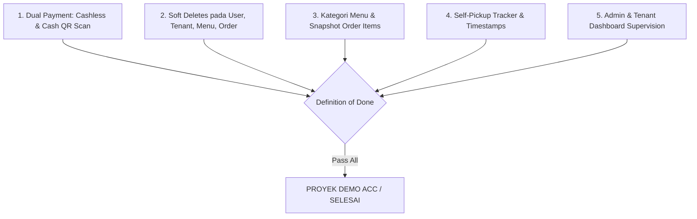

# Acceptance Criteria — Smart Canteen FEB

## 1. Quality Gate Overview

---

## 2. Checklist Acceptance Criteria

* [ ] Mahasiswa dapat memilih pembayaran **Cashless** (Midtrans Sandbox) atau **Cash** (Tunai di Stand).
* [ ] Mahasiswa menerima Kode QR & string `pickup_code` unik untuk setiap transaksi.
* [ ] Tenant memiliki fitur **Scan Kode QR / Input Kode** untuk mengonfirmasi pembayaran tunai.
* [ ] Model `User`, `Tenant`, `Menu`, dan `Order` mengimplementasikan Trait `SoftDeletes` (`deleted_at`).
* [ ] Model `OrderItem` menyimpan `menu_name` dan `price` sebagai snapshot saat transaksi dibuat.
* [ ] Tenant dapat mengelompokkan menu berdasarkan `Category`.
* [ ] Status pesanan mengupdate timestamp audit (`paid_at`, `processing_at`, `ready_at`, `completed_at`).
* [ ] Seluruh alur demo berjalan lancar tanpa merusak data historis.
