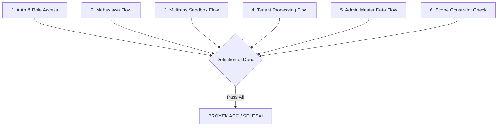

# Acceptance Criteria — Smart Canteen FEB

Dokumen ini mendefinisikan Kriteria Penerimaan (Acceptance Criteria) yang harus dipenuhi agar proyek Smart Canteen FEB dinyatakan selesai dan memenuhi scope.

---

## 1. Quality Gate Overview

---

## 2. Detail Acceptance Criteria Per Fitur

### 2.1 Authentication & Authorization
* [ ] User Mahasiswa, Tenant, dan Admin dapat login sesuai kredensial masing-masing.
* [ ] User yang mencoba mengakses URL di luar hak aksesnya (misal: Mahasiswa membuka `/admin/dashboard`) akan ditolak / di-redirect.

### 2.2 Katalog & Keranjang (Mahasiswa)
* [ ] Mahasiswa dapat melihat daftar tenant aktif di FEB.
* [ ] Mahasiswa dapat melihat daftar menu dan status ketersediaannya per tenant.
* [ ] Mahasiswa dapat menambah menu ke keranjang, memperbarui kuantitas, dan menghapus item dari keranjang.

### 2.3 Checkout & Midtrans Sandbox
* [ ] Mahasiswa dapat melakukan checkout dengan informasi rincian biaya dan metode **Self-Pickup**.
* [ ] Pop-up / widget Midtrans Sandbox dapat dipanggil saat tombol "Bayar" diklik.
* [ ] Setelah pembayaran sukses di Midtrans Sandbox, status pesanan otomatis diperbarui menjadi `Dibayar`.

### 2.4 Pemrosesan Pesanan (Tenant)
* [ ] Tenant dapat melihat pesanan baru berstatus `Dibayar` di dashboard tenant.
* [ ] Tenant dapat mengoperasikan alur status: `Dibayar` $\rightarrow$ `Diproses` $\rightarrow$ `Siap Diambil` $\rightarrow$ `Selesai`.
* [ ] Mahasiswa dapat memantau pembaruan status pesanan secara langsung di layar detail pesanan.
* [ ] Tenant dapat melakukan CRUD data menu dan mengubah toggle ketersediaan stok.

### 2.5 Master Data & Supervision (Admin)
* [ ] Admin dapat melihat statistik ringkas demo.
* [ ] Admin dapat melakukan CRUD data tenant dan mengelola akun pengguna.
* [ ] Admin dapat memantau seluruh transaksi di kantin FEB.

### 2.6 Kepatuhan Scope Project (No Scope Creep)
* [ ] Tidak terdapat fitur out-of-scope (Delivery, WA/SMS gateway, accounting, mobile app) yang dibangun tanpa persetujuan.
