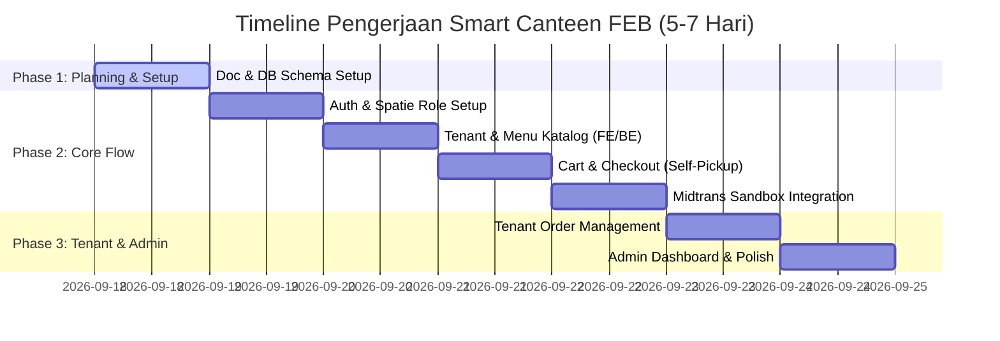

# Rencana Anggaran Biaya (RAB) — Smart Canteen FEB

Dokumen ini merincikan alokasi anggaran biaya (Rp1.000.000) dan estimasi pengerjaan (5–7 Hari Kerja) untuk pengembangan Website Demo Smart Canteen FEB.

---

## 1. Timeline & Budget Breakdown

---

## 2. Rincian Alokasi Biaya (Rp1.000.000)

| No | Modul / Komponen Pekerjaan | Bobot (%) | Biaya (IDR) | Output / Deliverables |
| :--- | :--- | :---: | :---: | :--- |
| 1 | **Setup Project, Spatie Auth & DB Schema** | 15% | Rp150.000 | Core Laravel 12 + Inertia React setup, Roles (`mahasiswa`, `tenant`, `admin`), Database Migration & Seeders. |
| 2 | **Modul Mahasiswa (Katalog, Cart & Checkout)** | 30% | Rp300.000 | Halaman Tenant, Detail Menu, Cart Management, Checkout **Self-Pickup**. |
| 3 | **Integrasi Pembayaran Midtrans Sandbox** | 20% | Rp200.000 | Midtrans Snap Integration, Webhook Notification Handler, Pembayaran Demo Flow. |
| 4 | **Modul Tenant & Order Management** | 20% | Rp200.000 | Tenant Dashboard, Kanban Order Tracker Status (`Dibayar` $\rightarrow$ `Diproses` $\rightarrow$ `Siap Diambil`), CRUD Menu Tenant. |
| 5 | **Modul Admin & UI Polish** | 15% | Rp150.000 | Admin Dashboard, Master Tenant & User CRUD, Responsive Design Polish & Manual Testing. |
| **TOTAL** | | **100%** | **Rp1.000.000** | **Website Demo Ready Smart Canteen FEB** |

---

## 3. Syarat & Ketentuan Pembayaran

1. **Total Biaya:** Rp1.000.000 (Nett).
2. **Lingkup Pekerjaan:** Sesuai dengan [01-scope.md](file:///home/darbi/Projects/smart_canteen/docs/01-scope.md).
3. **Change Request:** Setiap permintaan fitur tambahan di luar dokumen `docs/` akan dikenakan penyesuaian biaya dan waktu pengerjaan tersendiri.
