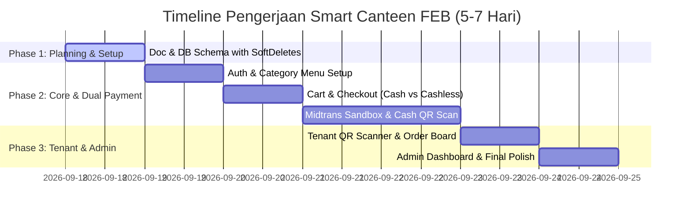

# Rencana Anggaran Biaya (RAB) — Smart Canteen FEB

Dokumen ini merincikan alokasi anggaran biaya (Rp1.000.000) dan estimasi pengerjaan (5–7 Hari Kerja) untuk pengembangan Website Demo Smart Canteen FEB.

---

## 1. Timeline & Budget Breakdown

---

## 2. Rincian Alokasi Biaya (Rp1.000.000)

| No | Modul / Komponen Pekerjaan | Bobot (%) | Biaya (IDR) | Output / Deliverables |
| :--- | :--- | :---: | :---: | :--- |
| 1 | **Setup Architecture, DB Schema & SoftDeletes** | 15% | Rp150.000 | Core setup Laravel 12 + Inertia React, Spatie Roles, Migration with SoftDeletes & Categories. |
| 2 | **Modul Mahasiswa (Katalog Kategori & Checkout)** | 25% | Rp250.000 | Katalog Menu per Kategori, Cart, Checkout pilihan Cashless / Cash, Digital QR Code display. |
| 3 | **Dual Payment Engine (Midtrans & Cash QR Scan)**| 25% | Rp250.000 | Midtrans Sandbox integration + Tenant QR Code Scanner / Input Code Verifier for Cash payment. |
| 4 | **Modul Tenant (Order Board & Menu CRUD)** | 20% | Rp200.000 | Tenant Order Status Board (`Dibayar` $\rightarrow$ `Diproses` $\rightarrow$ `Siap Diambil`), Category & Menu CRUD (Soft Delete). |
| 5 | **Modul Admin & Final Polish** | 15% | Rp150.000 | Admin Supervision Dashboard, Master Data Management, Responsive Mobile & Desktop polish. |
| **TOTAL** | | **100%** | **Rp1.000.000** | **Website Demo Ready Smart Canteen FEB** |
