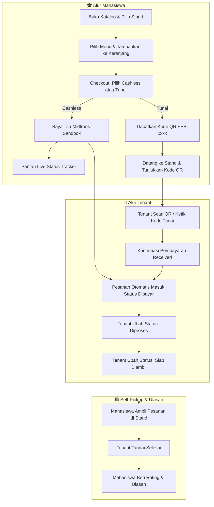

# 📚 Pusat Panduan Pengguna — Smart Canteen FEB

Selamat datang di **Pusat Panduan Pengguna Smart Canteen FEB**. Panduan ini dirancang untuk membantu seluruh pengguna aplikasi — mulai dari **Mahasiswa**, **Pemilik Stand (Tenant)**, hingga **Administrator** — dalam menggunakan seluruh fitur aplikasi secara optimal dan mudah.

---

## 🗺️ Peta Navigasi Panduan

Pilihlah panduan yang sesuai dengan peran Anda di sistem Smart Canteen FEB:

| Peran Pengguna | Deskripsi Fitur Utama | Dokumen Panduan | Halaman Interactive |
| :--- | :--- | :---: | :---: |
| 🔐 **Semua Pengguna** | Pendaftaran, Login, Lupa Password, Edit Profil & Keamanan (2FA) | [📄 Panduan Autentikasi](autentikasi.md) | [🌐 Buka HTML](../index.html) |
| 🎓 **Mahasiswa / Pembeli** | Cari Stand, Pesan Menu, Checkout Cashless & Tunai, Live Tracker, Rating | [📄 Panduan Mahasiswa](mahasiswa.md) | [🌐 Buka HTML](../mahasiswa.html) |
| 🏪 **Tenant / Pemilik Stand** | Manajemen Menu & Stok, Terima Pesanan, Scan QR Bayar Tunai, Rating | [📄 Panduan Tenant](tenant.md) | [🌐 Buka HTML](../tenant.html) |
| 🛡️ **Admin System** | Monitoring Transaksi, Kelola Stand Tenant, Kelola User & Biaya Layanan | [📄 Panduan Admin](admin.md) | [🌐 Buka HTML](../admin.html) |

---

## 🔄 Gambaran Umum Alur Bisnis Kantin Digital

---

## 💡 Fitur Unggulan Sistem Smart Canteen FEB

1. **Dual Payment Engine (Cashless & Cash)**:
   - **Cashless**: Terintegrasi langsung dengan Midtrans Gateway (Qris, GoPay, Virtual Account, Bank Transfer).
   - **Tunai / Cash**: Mahasiswa mendapatkan Kode QR & string `FEB-xxxx`, bayar langsung di kasir stand, lalu tenant mengonfirmasi via scanner QR.
2. **Real-time Live Order Status**: Tracker visual 5 tahap (`Menunggu Pembayaran` ➔ `Dibayar` ➔ `Diproses` ➔ `Siap Diambil` ➔ `Selesai`).
3. **Data Integrity & Soft Delete**: Data riwayat transaksi aman 100%, tidak hilang meskipun menu/tenant dinonaktifkan.
4. **Management Stok Instant**: Tenant dapat mengubah status menu *Tersedia / Stok Habis* dalam 1-klik.

---

## 📞 Bantuan & Dukungan

Jika Anda mengalami kendala teknis atau pertanyaan operasional:
- 📩 Email Support: `support@smartcanteen-feb.ac.id`
- 🏢 Sekretariat FEB: Ruang Pengelola Kantin Lantai 1 Gedung FEB
