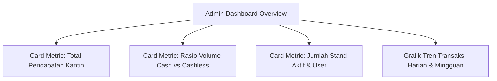
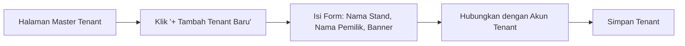
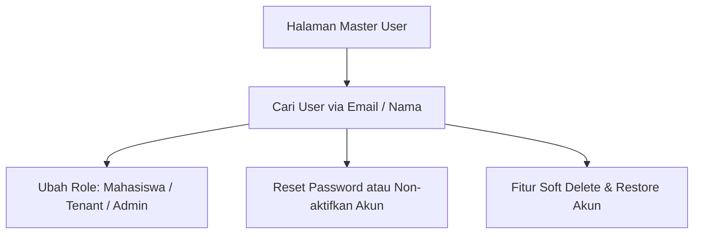
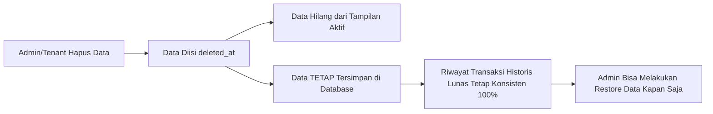

# 🛡️ Panduan Penggunaan — Administrator

Panduan ini diperuntukkan bagi **Administrator Sistem Smart Canteen FEB** dalam memantau statistik operasional kantin, mengelola master data stand tenant, mengelola pengguna & role, serta mengatur konfigurasi pembayaran global.

---

## 📌 Daftar Isi
1. [Dashboard Pengawasan Admin](#1-dashboard-pengawasan-admin)
2. [Manajemen Data Stand Tenant](#2-manajemen-data-stand-tenant)
3. [Manajemen Pengguna & Role (Users)](#3-manajemen-pengguna--role-users)
4. [Supervisi & Monitoring Transaksi Global](#4-supervisi--monitoring-transaksi-global)
5. [Pengaturan Pembayaran & Biaya Layanan](#5-pengaturan-pembayaran--biaya-layanan)
6. [Audit Data & Keamanan Soft Delete](#6-audit-data--keamanan-soft-delete)

---

## 1. Dashboard Pengawasan Admin

Setelah masuk dengan akun **Administrator**, Anda akan diarahkan ke Dashboard Admin (`/admin/dashboard`).

### Indikator Utama (KPI Cards):
- 💰 **Total Transaksi**: Nilai total rupiah transaksi yang berhasil dilakukan di kantin FEB.
- 💳 **Rasio Cash vs Cashless**: Persentase penggunaan pembayaran digital (Midtrans) dibandingkan uang tunai di kasir stand.
- 🏪 **Tenant Aktif**: Jumlah stand kantin yang sedang beroperasi di lingkungan FEB.
- 👥 **Total Pengguna**: Jumlah akun mahasiswa, tenant, dan admin terdaftar.

---

## 2. Manajemen Data Stand Tenant

Admin bertanggung jawab mendaftarkan dan memantau seluruh stand / kantin di lingkungan FEB (`/admin/tenants`).

### 2.1 Menambah Stand Tenant Baru
1. Navigasi ke menu **Master Tenant** (`/admin/tenants`).
2. Klik tombol **+ Tambah Tenant Baru**.
3. Lengkapi formulir:
   - **Nama Stand**: Nama usaha (contoh: *Kantin Bakso FEB*).
   - **Slug URL**: Nama unik di URL (contoh: `bakso-feb`).
   - **Pemilik Stand**: Pilih akun pengguna bertipe *Tenant* yang akan mengelola stand ini.
   - **Deskripsi & Foto Banner**: Deskripsi singkat dan gambar header stand.
4. Klik **Simpan Tenant**.

### 2.2 Mengubah / Non-aktifkan Stand
- **Edit Info**: Klik tombol **Edit** pada baris tenant untuk mengubah nama, pemilik, atau deskripsi.
- **Non-aktifkan Stand**: Jika stand melanggar aturan atau libur semester, ubah status `is_active` menjadi **Non-aktif**. Stand tidak akan muncul di katalog mahasiswa.

---

## 3. Manajemen Pengguna & Role (Users)

Admin dapat mengelola daftar seluruh pengguna terdaftar pada sistem (`/admin/users`).

### 3.1 Mengubah Role Pengguna
1. Buka menu **Master Pengguna** (`/admin/users`).
2. Gunakan kolom pencarian untuk menemukan akun berdasarkan nama atau email.
3. Klik tombol **Edit Role**.
4. Pilih peran yang sesuai:
   - `mahasiswa`: Pengguna umum pembeli makanan.
   - `tenant`: Penjual / pemilik stand.
   - `admin`: Pengelola sistem penuh.
5. Klik **Simpan Role**.

---

## 4. Supervisi & Monitoring Transaksi Global

Admin memiliki akses pengawasan ke seluruh transaksi kantin tanpa batas stand (`/admin/orders`).

### Fitur Monitoring:
- **Filter Transaksi**: Filter pesanan berdasarkan **Tanggal**, **Tenant**, **Metode Pembayaran (Cash/Cashless)**, atau **Status Pesanan**.
- **Audit Detail Pesanan**: Klik salah satu nomor order (misal: `SC-20260920-004`) untuk melihat rincian item, waktu pembayaran, hingga kasir tenant yang mengonfirmasi.
- **Export Data**: Ekspor laporan transaksi ke format CSV/Excel untuk kebutuhan rekapitulasi keuangan fakultas.

---

## 5. Pengaturan Pembayaran & Biaya Layanan

Mengatur parameter gateway pembayaran dan biaya admin aplikasi (`/admin/payment-settings`).

### 5.1 Mode Midtrans Gateway (Sandbox / Production)
- Masukkan **Client Key** dan **Server Key** dari akun Midtrans Merchant FEB.
- Tentukan status lingkungan (*Environment*): `Sandbox` (untuk uji coba demo) atau `Production` (untuk pemakaian riil).

### 5.2 Pengaturan Biaya Layanan (Admin Fee)
- Tentukan apakah transaksi dikenakan **Biaya Penanganan / Admin Fee** per transaksi (misal: `Rp1.000` per checkout).
- Simpan perubahan pengaturan.

---

## 6. Audit Data & Keamanan Soft Delete

Seluruh penghapusan data penting pada aplikasi Smart Canteen FEB menerapkan prinsip **Soft Delete** (`deleted_at`).

- **Penting**: Penonaktifan akun pengguna, stand tenant, maupun menu makanan **TIDAK AKAN** merusak laporan transaksi masa lalu.
- Jika data tidak sengaja terhapus, Admin dapat masuk ke tab **Sampah / Deleted Records** di halaman masing-masing dan mengklik **Pulihkan (Restore)** untuk mengembalikan data seperti semula.

---

[⬅️ Kembali ke Indeks Panduan](README.md)
