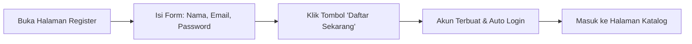
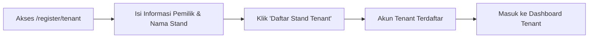
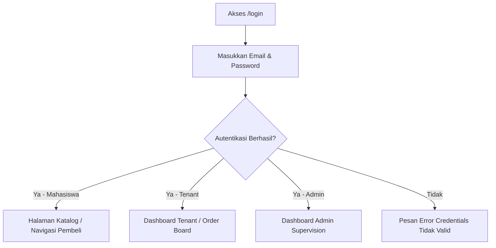

# 🔐 Panduan Autentikasi & Pengaturan Akun

Dokumen ini menjelaskan alur pendaftaran, masuk ke sistem (login), pemulihan akun, serta pengaturan keamanan untuk seluruh pengguna Smart Canteen FEB.

---

## 📌 Daftar Isi
1. [Registrasi Akun Mahasiswa](#1-registrasi-akun-mahasiswa)
2. [Registrasi Akun Tenant (Pemilik Stand)](#2-registrasi-akun-tenant-pemilik-stand)
3. [Masuk ke Aplikasi (Login)](#3-masuk-ke-aplikasi-login)
4. [Lupa & Reset Password](#4-lupa--reset-password)
5. [Pengaturan Profil & Keamanan (2FA)](#5-pengaturan-profil--keamanan-2fa)
6. [Keluar dari Sistem (Logout)](#6-keluar-dari-sistem-logout)

---

## 1. Registrasi Akun Mahasiswa

Mahasiswa FEB yang belum memiliki akun dapat mendaftar secara mandiri melalui halaman pendaftaran.

### Langkah-langkah:
1. Akses alamat web Smart Canteen FEB, lalu klik **Daftar** di pojok kanan atas (atau navigasi ke `/register`).
2. Masukkan informasi berikut pada form:
   - **Nama Lengkap**: Contoh `Budi Santoso`
   - **Email**: Gunakan email kampus atau email aktif (Contoh: `budi@mhs.feb.ac.id`)
   - **Kata Sandi (Password)**: Minimal 8 karakter.
   - **Konfirmasi Kata Sandi**: Ulangi kata sandi yang sama.
3. Klik tombol **Daftar / Register**.
4. Setelah berhasil, Anda akan otomatis masuk sebagai peran **Mahasiswa** dan diarahkan ke Halaman Katalog Stand FEB.

---

## 2. Registrasi Akun Tenant (Pemilik Stand)

Calon Pemilik Stand / Kantin FEB mendaftar melalui form registrasi khusus tenant.

### Langkah-langkah:
1. Buka tautan registrasi tenant di `/register/tenant` atau klik opsi **Daftar Sebagai Tenant** di halaman login.
2. Lengkapi formulir pendaftaran tenant:
   - **Nama Pemilik**: Nama penanggung jawab stand.
   - **Nama Stand / Kantin**: Contoh `Kantin Soto Ayam Pak Kumis`.
   - **Email Operasional**: Email yang digunakan untuk mengelola pesanan.
   - **Kata Sandi**: Password akun tenant.
3. Tekan tombol **Daftar Stand Tenant**.
4. Sistem akan membuat akun dengan role **Tenant** dan mengarahkan Anda ke Dashboard Pengelolaan Stand (`/tenant/dashboard`).

---

## 3. Masuk ke Aplikasi (Login)

### Langkah-langkah:
1. Klik tombol **Masuk / Login** pada header situs (atau navigasi ke `/login`).
2. Masukkan **Email** dan **Kata Sandi** terdaftar Anda.
3. (Opsional) Centang opsi **Ingat Saya (Remember Me)** jika ingin sesi login tetap tersimpan di browser Anda.
4. Klik **Masuk**.
5. Sistem akan mengarahkan halaman sesuai peran akun Anda:
   - 🎓 **Mahasiswa** $\rightarrow$ Katalog Kantin (`/catalog`)
   - 🏪 **Tenant** $\rightarrow$ Dashboard Tenant (`/tenant/dashboard`)
   - 🛡️ **Admin** $\rightarrow$ Dashboard Admin (`/admin/dashboard`)

---

## 4. Lupa & Reset Password

Jika Anda lupa kata sandi akun Anda:
1. Di halaman login, klik tautan **Lupa kata sandi?** (`/forgot-password`).
2. Masukkan alamat email terdaftar Anda, lalu klik **Kirim Tautan Reset Password**.
3. Cek kotak masuk (inbox) atau folder spam email Anda untuk menerima email petunjuk reset password.
4. Klik tautan di dalam email, lalu masukkan kata sandi baru Anda.

---

## 5. Pengaturan Profil & Keamanan (2FA)

Seluruh pengguna dapat memperbarui profil dan meningkatkan keamanan akun via menu **Pengaturan (Settings)**.

### 5.1 Edit Profil & Foto
- Navigasi ke ikon profil $\rightarrow$ **Settings** $\rightarrow$ **Profile** (`/settings/profile`).
- Ubah **Nama Lengkap** atau **Alamat Email**.
- Upload foto profil baru jika diperlukan, lalu klik **Simpan Perubahan**.

### 5.2 Ubah Kata Sandi
- Navigasi ke **Settings** $\rightarrow$ **Security** (`/settings/security`).
- Masukkan **Kata Sandi Saat Ini**, **Kata Sandi Baru**, dan **Konfirmasi Kata Sandi Baru**.
- Klik **Perbarui Password**.

### 5.3 Two-Factor Authentication (2FA) / Autentikasi Dua Langkah
- Pada menu **Security**, temukan bagian **Two-Factor Authentication**.
- Klik **Enable 2FA**.
- Scan kode QR yang tampil menggunakan aplikasi authenticator (seperti Google Authenticator atau Authy).
- Masukkan kode 6-digit OTP dari aplikasi untuk konfirmasi.
- **Penting**: Simpan kode pemulihan (*Recovery Codes*) di tempat aman untuk mengantisipasi jika smartphone Anda hilang.

---

## 6. Keluar dari Sistem (Logout)

Untuk mengakhiri sesi pengguna:
1. Klik foto/nama profil Anda di sudut kanan atas halaman.
2. Pilih opsi **Keluar / Logout**.
3. Sesi Anda akan ditutup dan Anda dikembalikan ke halaman login utama.

---

[⬅️ Kembali ke Indeks Panduan](README.md) | [Lanjut ke Panduan Mahasiswa ➡️](mahasiswa.md)
