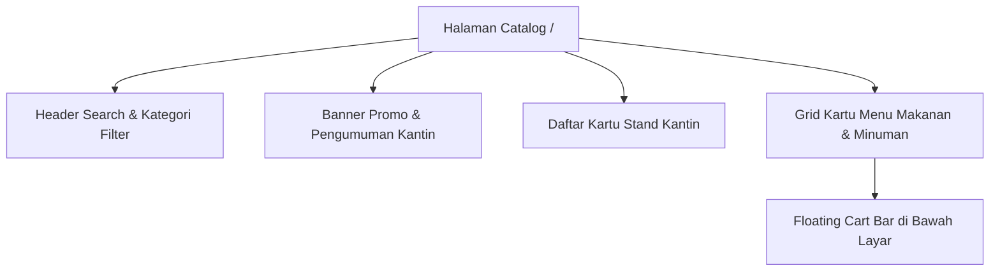
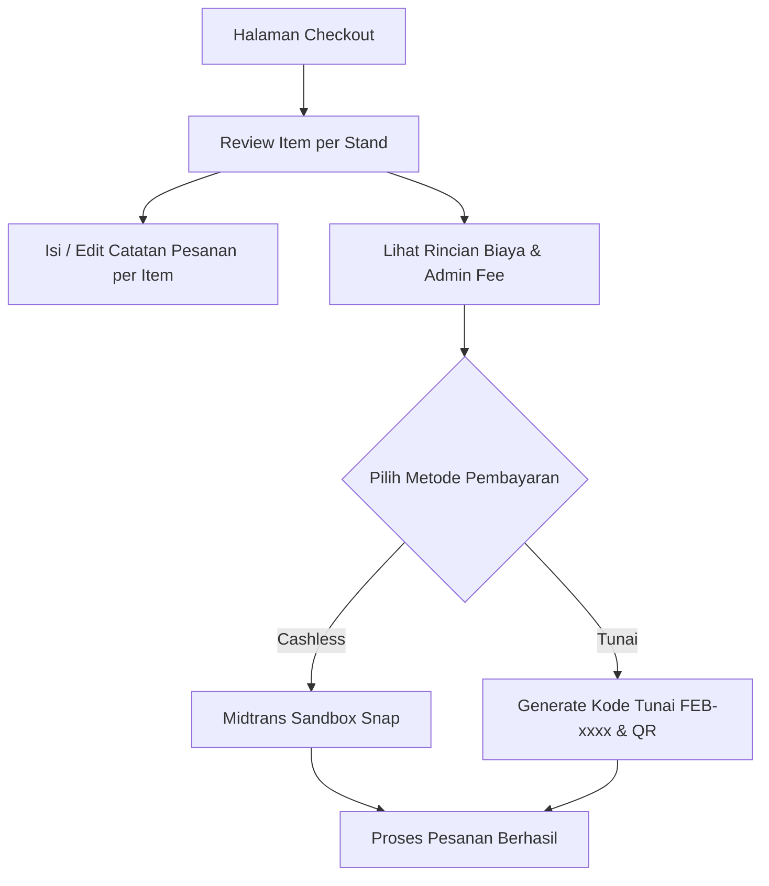
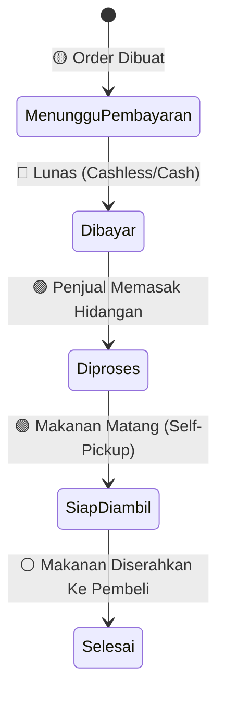

# 🎓 Panduan Penggunaan Lengkap — Mahasiswa (Pembeli)

Selamat datang di **Panduan Penggunaan Lengkap Fitur Mahasiswa Smart Canteen FEB**. Dokumen ini disusun secara amat rinci, menjelaskan **setiap fitur, tombol, elemen antarmuka, dan alur transaksi** dari sudut pandang pembeli (Mahasiswa).

---

## 📌 Daftar Isi Fitur
1. [Fitur Autentikasi & Quick Role Switcher](#1-fitur-autentikasi--quick-role-switcher)
2. [Fitur Beranda & Katalog Utama (`/catalog`)](#2-fitur-beranda--katalog-utama-catalog)
3. [Fitur Filter & Pencarian Menu Cepat](#3-fitur-filter--pencarian-menu-cepat)
4. [Fitur Halaman Detail Stand Kantin (`/{tenant:slug}`)](#4-fitur-halaman-detail-stand-kantin-tenant-slug)
5. [Fitur Modal Detail Menu & Catatan Pesanan](#5-fitur-modal-detail-menu--catatan-pesanan)
6. [Fitur Floating Cart Bar (Bilah Keranjang Melayang)](#6-fitur-floating-cart-bar-bilah-keranjang-melayang)
7. [Fitur Keranjang & Checkout Multi-Stand (`/checkout`)](#7-fitur-keranjang--checkout-multi-stand-checkout)
8. [Fitur Modul Pembayaran Cashless (Midtrans Sandbox)](#8-fitur-modul-pembayaran-cashless-midtrans-sandbox)
9. [Fitur Modul Pembayaran Tunai & Digital Pickup Pass](#9-fitur-modul-pembayaran-tunai--digital-pickup-pass)
10. [Fitur Live Order Status Tracker & Timestamps (`/orders/{id}`)](#10-fitur-live-order-status-tracker--timestamps-ordersid)
11. [Fitur Prosedur Self-Pickup di Stand](#11-fitur-prosedur-self-pickup-di-stand)
12. [Fitur Penilaian Rating & Ulasan Menu](#12-fitur-penilaian-rating--ulasan-menu)
13. [Fitur Riwayat Transaksi & Invoice Digital (`/orders`)](#13-fitur-riwayat-transaksi--invoice-digital-orders)
14. [Fitur Pengaturan Profil & Keamanan Akun (`/settings`)](#14-fitur-pengaturan-profil--keamanan-akun-settings)

---

## 1. Fitur Autentikasi & Quick Role Switcher

Sebelum dapat membuat pesanan, Anda harus masuk ke dalam aplikasi.

### 1.1 Registrasi & Login
- **Halaman Register (`/register`)**: Isikan Nama Lengkap, Email Kampus/Pribadi, Password (min 8 karakter), dan Konfirmasi Password.
- **Halaman Login (`/login`)**: Input Email dan Password. Centang *Ingat Saya* agar sesi login tidak hilang saat browser ditutup.
- **Tombol Lupa Password**: Memungkinkan reset kata sandi melalui pengiriman link konfirmasi ke email.

### 1.2 Banner Quick Role Switcher (Khusus Mode Demo)
- Di bagian atas atau navigasi aplikasi terdapat **Bilah Switcher Role Instant**.
- Digunakan untuk berpindah peran secara cepat (misal dari *Mahasiswa* ke *Tenant Pak Kumis* atau *Admin*) tanpa harus logout-login manual.

---

## 2. Fitur Beranda & Katalog Utama (`/catalog`)

Halaman utama katalog adalah pusat eksplorasi seluruh jajanan dan makanan di kantin FEB.



### Elemen-Elemen Halaman Katalog:
- **Header Carousel Banner**: Menampilkan slide banner promo, rekomendasi menu terlaris, atau jam operasional khusus kantin.
- **Badge Status Stand (Buka / Tutup)**:
  - 🟢 **Buka**: Card stand berwarna cerah, menu dapat ditambahkan ke keranjang.
  - 🔴 **Tutup**: Card stand agak redup dengan label *"Stand Tutup"*, menu tidak dapat dipesan.
- **Rating & Total Ulasan Stand**: Menampilkan rata-rata bintang (misal: ⭐ `4.8 (120 ulasan)`).
- **Kartu Menu (Food Cards)**:
  - **Foto Menu**: Thumbnail hidangan beresolusi tinggi.
  - **Tag Rekomendasi**: Badge warna emas *"Best Seller"* atau *"Rekomendasi"*.
  - **Harga Rp**: Format harga rupiah jelas (misal: `Rp 15.000`).
  - **Stok Badge**: Menampilkan ketersediaan (*Tersedia* atau *Stok Habis*).
  - **Tombol Counter (+ / -)**: Tombol untuk menambah atau mengurangi jumlah porsi hidangan.

---

## 3. Fitur Filter & Pencarian Menu Cepat

Memudahkan mahasiswa menemukan makanan favorit saat waktu istirahat kuliah yang terbatas.

### 3.1 Live Search Bar
- Ketik nama makanan (misal: `Ayam`, `Es Teh`, `Soto`) atau nama stand (misal: `Pak Kumis`).
- Hasil katalog akan tersaring secara otomatis tanpa me-refresh halaman (*Instant Real-time Filter*).

### 3.2 Tab Kategori Global
- **Semua Menu**: Menampilkan seluruh produk kantin.
- **Makanan Utama**: Nasi goreng, ayam geprek, soto, mie ayam, dll.
- **Minuman**: Es teh, kopi, jus buah, air mineral, dll.
- **Camilan / Snack**: Gorengan, kue, dimsum, kentang goreng, dll.

---

## 4. Fitur Halaman Detail Stand Kantin (`/{tenant:slug}`)

Setiap stand kantin memiliki halaman profil khusus yang menampilkan identitas dan seluruh menu miliknya.

### Komponen Halaman Detail Stand:
- **Header Cover Banner & Logo**: Tampilan visual toko/stand.
- **Deskripsi Stand & Jam Operasional**: Informasi lokasi spesifik di kantin FEB dan waktu operasional.
- **Filter Internal Stand**: Tab penyaring kategori menu khusus milik stand tersebut.
- **Daftar Menu Stand**: Menampilkan menu hidangan utama hingga hidangan penutup yang dijual oleh stand ini.

---

## 5. Fitur Modal Detail Menu & Catatan Pesanan

Saat Anda mengklik kartu menu (pada area gambar/nama menu), modal detail interaktif akan muncul di layar.

```
+-------------------------------------------------------+
|  [FOTO MENU BESAR]                                [X] |
|                                                       |
|  Nasi Ayam Geprek Sambal Korek                        |
|  Rp 18.000  • ⭐ 4.9 (45 ulasan)                        |
|  Nasi hangat dengan ayam goreng crispy digeprek       |
|  sambal korek pedas gurih khas FEB.                   |
|                                                       |
|  Catatan Khusus (Opsional):                           |
|  [ Misal: Sambal dipisah, nasi setengah porsi       ] |
|                                                       |
|  Jumlah:  [ - ]   2   [ + ]       Total: Rp 36.000    |
|  [ Tombol: Tambahkan ke Keranjang ]                   |
+-------------------------------------------------------+
```

### Informasi & Aksikan di Modal Detail Menu:
1. **Foto & Deskripsi Lengkap**: Informasi bahan dan rasa hidangan.
2. **Kolom Catatan Khusus Pesanan**:
   - Ketik permintaan khusus kepada penjual (contoh: *"Pedas manis"*, *"Es dikit aja"*, *"Tanpa seledri"*).
3. **Pengatur Kuantitas (+ / -)**: Menambah atau mengurangi porsi.
4. **Tombol Tambah ke Keranjang**: Simpan konfigurasi menu ini ke keranjang belanja Anda.

---

## 6. Fitur Floating Cart Bar (Bilah Keranjang Melayang)

Saat Anda telah menambahkan minimal 1 hidangan ke keranjang, bilah melayang (*Floating Cart*) akan muncul secara dinamis di bagian bawah layar HP / Laptop Anda.

```
+---------------------------------------------------------------+
| 🛒  3 Item | Total: Rp 42.000        [ Tombol: Checkout ➔ ]  |
+---------------------------------------------------------------+
```

- **Fitur Utama**:
  - Menampilkan jumlah total item porsi yang sudah dipilih.
  - Menampilkan akumulasi estimasi total harga rupiah.
  - **Tombol Checkout**: Mengarahkan Anda ke Halaman Checkout secara instan.

---

## 7. Fitur Keranjang & Checkout Multi-Stand (`/checkout`)

Halaman Checkout (`/checkout`) adalah tempat Anda memeriksa rincian pesanan dan memilih metode pembayaran.



### Rincian Komponen Halaman Checkout:
1. **Pengelompokan Item per Stand**:
   - Jika Anda memesan dari 2 stand berbeda (misal: *Nasi dari Stand A* dan *Es Teh dari Stand B*), pesanan akan dikelompokkan secara rapi berdasarkan nama stand.
2. **Edit Kuantitas & Hapus Item**:
   - Anda masih bisa mengubah jumlah porsi atau menghapus item yang tidak jadi dibeli.
3. **Rincian Biaya Transaksi**:
   - **Subtotal Makanan**: Total harga makanan/minuman.
   - **Biaya Layanan / Admin Fee**: Biaya penanganan aplikasi (jika ada).
   - **Total Tagihan Akhir**: Nominal pas yang harus dibayar.
4. **Radio Button Metode Pembayaran**:
   - 💳 **Cashless (QRIS / Bank Transfer / E-Wallet)**
   - 💵 **Tunai / Cash di Kasir Stand**

---

## 8. Fitur Modul Pembayaran Cashless (Midtrans Sandbox)

Metode pembayaran digital otomatis tanpa perlu membawa uang tunai fisik.

### Langkah demi Langkah Pembayaran Cashless:
1. Pilih opsi **Cashless** di checkout, lalu klik **Buat Pesanan**.
2. Pop-up **Midtrans Snap Modal** akan terbuka secara otomatis.
3. Karena aplikasi berjalan pada **Midtrans Sandbox (Mode Simulasi)**, gunakan salah satu metode pengujian berikut:

---

### 💡 Pilihan 1: BCA Virtual Account (SANGAT DIREKOMENDASIKAN)
- **Mengapa Direkomendasikan?**: Paling praktis dan cepat! Anda tidak perlu menyimpan, memotong, atau menyalin link gambar QR Code.
- **Langkah Pemakaian**:
  1. Pada pop-up Midtrans, pilih **Bank Transfer** $\rightarrow$ **BCA Virtual Account**.
  2. Salin **Nomor VA BCA** yang tampil (contoh: `910128391203912`).
  3. Buka Simulator Midtrans BCA VA di tab browser baru:  
     🔗 **Link Simulator BCA VA**: [https://simulator.sandbox.midtrans.com/bca/va/index](https://simulator.sandbox.midtrans.com/bca/va/index)
  4. Tempel (*paste*) Nomor VA tersebut di kolom input simulator, lalu klik tombol **Inquire**.
  5. Periksa nama & nominal tagihan, lalu klik tombol **Pay**.
  6. Selesai! Kembali ke tab aplikasi Smart Canteen FEB. Status pesanan Anda otomatis berubah menjadi **"Dibayar"** (`paid`).

---

### 📲 Pilihan 2: QRIS Simulator
- **Langkah Pemakaian**:
  1. Pada pop-up Midtrans, pilih **QRIS**.
  2. Dapatkan QRIS Code atau string payload.
  3. Buka Simulator QRIS di tab browser baru:  
     🔗 **Link Simulator QRIS**: [https://simulator.sandbox.midtrans.com/v2/qris/index](https://simulator.sandbox.midtrans.com/v2/qris/index)
  4. Masukkan payload/QRIS ke simulator untuk menyelesaikan bayar.
  5. Status pesanan Anda otomatis berubah menjadi **"Dibayar"** (`paid`).

---

## 9. Fitur Modul Pembayaran Tunai & Digital Pickup Pass

Bagi Anda yang ingin membayar menggunakan uang tunai fisik (Cash) langsung di kasir stand kantin FEB.

```
+-------------------------------------------------------+
|              PASS PENGAMBILAN DIGITAL                 |
|                                                       |
|                 [ GAMBAR QR CODE ]                    |
|                                                       |
|              KODE PENGAMBILAN: FEB-8921                |
|                                                       |
|  Status: 🟡 MENUNGGU PEMBAYARAN TUNAI                 |
|  Batas Waktu Bayar: 14 menit 52 detik                 |
|                                                       |
|  Tunjukkan QR / Kode di atas ke kasir stand kantin    |
|  FEB dan serahkan uang pas sebesar Rp 25.000          |
+-------------------------------------------------------+
```

### Elemen Digital Pickup Pass Tunai:
- **Kode Pengambilan Unik**: Format 8-karakter `FEB-XXXX` (misal: `FEB-8921`).
- **Gambar Kode QR Transaksi**: Kode matriks yang siap di-scan oleh penjual.
- **Timer Hitung Mundur Pembayaran**: Batas waktu 15 Menit untuk menyelesaikan pembayaran di kasir sebelum pesanan otomatis kedaluwarsa.
- **Prosedur di Kasir**: Datangi stand kantin FEB, tunjukkan layar ini ke penjual, dan serahkan uang tunai. Penjual akan me-scan QR Anda, dan status otomatis ter-update menjadi **Dibayar**.

---

## 10. Fitur Live Order Status Tracker & Timestamps (`/orders/{id}`)

Setelah pesanan berstatus *Dibayar*, Anda akan diarahkan ke Halaman Live Tracker (`/orders/{id}`). Halaman ini memperbarui status secara otomatis (*Real-time Polling*) tanpa perlu me-refresh browser!



### Rincian Indikator Visual 5 Stepper Tracker:

| Tahap Status | Tampilan Badge UI | Penjelasan & Timestamp Audit |
| :--- | :--- | :--- |
| **1. Menunggu Pembayaran** | 🟡 `Amber Badge` | Pesanan dibuat, menunggu konfirmasi bayar digital atau kasir tunai. |
| **2. Dibayar** | 🔵 `Blue Badge` | Pembayaran lunas! `paid_at: 10:15 WIB`. Pesanan masuk antrean dapur penjual. |
| **3. Diproses** | 🟣 `Purple Badge` | Penjual mengklik mulai masak! `processing_at: 10:17 WIB`. Makanan sedang disiapkan. |
| **4. Siap Diambil** | 🟢 `Green Pulse` *(Berkedip)* | Makanan matang & dikemas! `ready_at: 10:25 WIB`. Notifikasi visual menyala memberitahu pembeli. |
| **5. Selesai** | ⚪ `Gray Badge` | Makanan telah di-pickup. `completed_at: 10:28 WIB`. Transaksi selesai sepenuhnya. |

---

## 11. Fitur Prosedur Self-Pickup di Stand

Ketika status tracker Anda telah mencapai tahap **🟢 Siap Diambil**:

1. Berjalanlah ke area kantin FEB menuju stand tempat Anda memesan.
2. Tunjukkan layar HP Anda yang menampilkan Halaman Tracker / Kode `FEB-XXXX`.
3. Penjual akan menyerahkan bungkus/piring makanan Anda.
4. Penjual mengklik tombol *Selesai*, dan tracker Anda akan otomatis diperbarui menjadi **Selesai**.

---

## 12. Fitur Penilaian Rating & Ulasan Menu

Memberikan umpan balik (feedback) rasa makanan dan pelayanan stand setelah pesanan selesai.

```
+-------------------------------------------------------+
|  BERIKAN ULASAN PESANAN                               |
|                                                       |
|  Beri Bintang:  [ ⭐ ] [ ⭐ ] [ ⭐ ] [ ⭐ ] [ ⭐ ]     |
|                                                       |
|  Ulasan Anda:                                         |
|  [ Ayam gepreknya krispi, sambalnya mantap pedas!   ] |
|                                                       |
|  [ Tombol: Kirim Ulasan ]                             |
+-------------------------------------------------------+
```

### Cara Memberi Rating:
1. Buka detail pesanan yang sudah *Selesai*, lalu klik tombol **Beri Ulasan**.
2. Pilih jumlah bintang dari 1 hingga 5 ⭐:
   - ⭐ 1: Sangat Buruk
   - ⭐ 3: Cukup Baik
   - ⭐ 5: Sangat Memuaskan!
3. Ketik Ulasan / Catatan kesan Anda mengenai makanan atau kebersihan stand.
4. Klik **Kirim Ulasan**. Rating Anda langsung memengaruhi skor rata-rata stand di katalog!

---

## 13. Fitur Riwayat Transaksi & Invoice Digital (`/orders`)

Daftar seluruh rekam jejak belanja Anda di kantin FEB (`/orders` atau `/orders/history`).

### Komponen Halaman Riwayat:
- **Tab Pesanan Aktif**: Memantau pesanan yang sedang berjalan (Menunggu Bayar, Diproses, Siap Diambil).
- **Tab Riwayat Selesai**: Daftar seluruh belanjaan masa lalu yang telah selesai atau dibatalkan.
- **Rincian Invoice Digital**:
  - Nomor Pesanan Unik (misal: `SC-20260920-008`).
  - Tanggal & Jam Transaksi.
  - Nama Stand & Rincian Item (Snapshot nama & harga menu tetap utuh meskipun menu di-edit penjual).
  - Metode Pembayaran (Cashless / Cash).
- **Tombol Pesan Lagi (Re-Order)**: Menyalin isi pesanan lama langsung ke keranjang belanja Anda untuk pemesanan ulang secara cepat!

---

## 14. Fitur Pengaturan Profil & Keamanan Akun (`/settings`)

Pusat kendali identitas dan keamanan akun mahasiswa.

### 14.1 Halaman Profile (`/settings/profile`)
- **Edit Nama & Email**: Perbarui nama lengkap atau alamat email mahasiswa Anda.
- **Upload Foto Profil**: Unggah foto avatar profil baru (format JPG/PNG).

### 14.2 Halaman Security (`/settings/security`)
- **Ubah Password**: Ganti kata sandi lama dengan kata sandi baru.
- **Two-Factor Authentication (2FA)**: Aktifkan autentikasi 2-langkah dengan scan QR di Google Authenticator untuk melindungi akun dari akses tak dikenal.

### 14.3 Halaman Appearance (`/settings/appearance`)
- **Tema Tampilan**: Pilih mode **Dark Mode (Mode Gelap)** yang elegan atau **Light Mode (Mode Terang)** sesuai preferensi mata Anda.

---

[⬅️ Kembali ke Indeks Utama Panduan](README.md)
