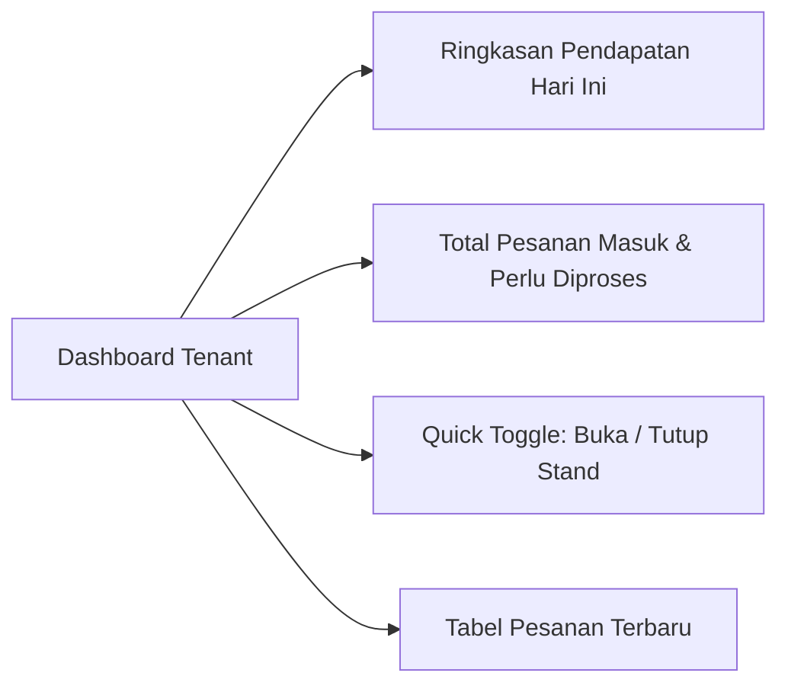
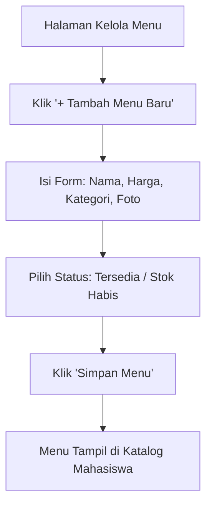
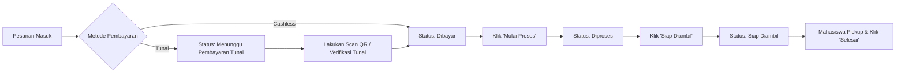
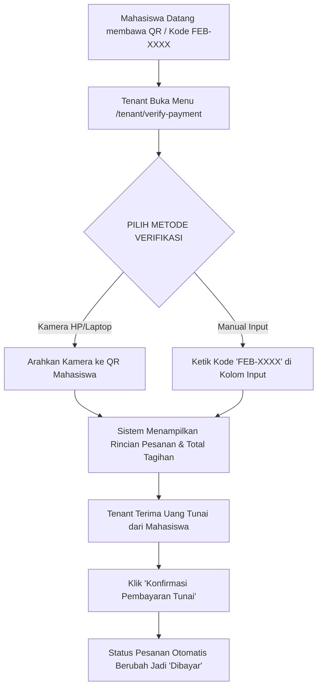

# 🏪 Panduan Penggunaan — Tenant (Pemilik Stand)

Panduan ini ditujukan bagi **Pemilik Stand / Kantin FEB (Tenant)** dalam mengoperasikan aplikasi Smart Canteen FEB, mengelola daftar menu, memproses pesanan masuk, memverifikasi pembayaran tunai via Scan QR, serta memantau performa penjualan.

---

## 📌 Daftar Isi
1. [Dashboard Operasional Tenant](#1-dashboard-operasional-tenant)
2. [Pengaturan Profil Stand & Status Operasional](#2-pengaturan-profil-stand--status-operasional)
3. [Manajemen Kategori Menu](#3-manajemen-kategori-menu)
4. [Manajemen Katalog Menu (CRUD & Stok)](#4-manajemen-katalog-menu-crud--stok)
   - [4.1 Menambah Menu Baru](#41-menambah-menu-baru)
   - [4.2 Mengatur Ketersediaan Stok (Toggle Stock)](#42-mengatur-ketersediaan-stok-toggle-stock)
   - [4.3 Soft Delete & Fitur Sampah (Restore Data)](#43-soft-delete--fitur-sampah-restore-data)
5. [Pengelolaan Pesanan Masuk (Order Board)](#5-pengelolaan-pesanan-masuk-order-board)
6. [Verifikasi Pembayaran Tunai (QR Scan / Kode Tunai)](#6-verifikasi-pembayaran-tunai-qr-scan--kode-tunai)
7. [Melihat Rating & Ulasan Mahasiswa](#7-melihat-rating--ulasan-mahasiswa)

---

## 1. Dashboard Operasional Tenant

Setelah login sebagai akun **Tenant**, Anda langsung masuk ke Dashboard Utama (`/tenant/dashboard`).

### Informasi di Dashboard:
- **Pendapatan Hari Ini**: Total omset transaksi yang sudah berstatus *Dibayar* atau *Selesai*.
- **Jumlah Pesanan Per Status**: Berapa pesanan yang perlu diproses dan siap diambil.
- **Rasio Pembayaran**: Perbandingan pembeli yang menggunakan Cashless vs Tunai.

---

## 2. Pengaturan Profil Stand & Status Operasional

Untuk mengatur informasi stand dan mengubah status operasional (buka/tutup kantin):

### 2.1 Buka / Tutup Stand Kantin
- Pada sudut kanan atas dashboard atau menu **Pengaturan Stand** (`/tenant/settings`), temukan switch **Status Stand**.
- **Buka Stand (Hijau)**: Stand Anda tampil di halaman katalog mahasiswa dan siap menerima pesanan.
- **Tutup Stand (Merah)**: Stand Anda ditandai *Tutup* di katalog, dan mahasiswa tidak bisa menambah menu ke keranjang.

### 2.2 Mengubah Informasi & Banner Stand
- Buka menu **Pengaturan Stand** (`/tenant/settings`).
- Ubah **Nama Stand**, **Deskripsi**, atau **Jam Operasional**.
- Upload **Logo Stand** atau **Gambar Banner Header** baru agar tampilan stand Anda menarik di HP mahasiswa.
- Klik **Simpan Pengaturan**.

---

## 3. Manajemen Kategori Menu

Mengelompokkan makanan dan minuman agar mudah ditemukan oleh pembeli (`/tenant/categories`).

1. Buka menu **Kategori Menu**.
2. Klik tombol **+ Tambah Kategori**.
3. Ketik nama kategori (Contoh: `Makanan Utama`, `Minuman Dingin`, `Snack / Camilan`).
4. Klik **Simpan**.
5. Kategori ini akan langsung menjadi tab penyaring di katalog halaman mahasiswa.

---

## 4. Manajemen Katalog Menu (CRUD & Stok)

Kelola makanan/minuman yang dijual di stand Anda (`/tenant/menus`).

### 4.1 Menambah Menu Baru
1. Buka menu **Daftar Menu** (`/tenant/menus`), lalu klik **+ Tambah Menu**.
2. Isi formulir pembuatan menu:
   - **Nama Menu**: Contoh `Ayam Geprek Sambal Korek`
   - **Kategori**: Pilih dari kategori yang sudah Anda buat.
   - **Harga**: Masukkan angka harga (Contoh `15000`).
   - **Deskripsi**: Penjelasan singkat komposisi/rasa menu.
   - **Foto Menu**: Unggah foto makanan yang menarik (format JPG/PNG).
   - **Menu Rekomendasi**: Centang opsi *Rekomendasi* jika menu ini adalah *Best Seller*.
3. Klik **Simpan Menu**.

### 4.2 Mengatur Ketersediaan Stok (Toggle Stock)
Jika bahan makanan habis saat jam istirahat:
- Di tabel menu (`/tenant/menus`), temukan tombol saklar **Tersedia / Habis** pada baris menu tersebut.
- Geser saklar menjadi **Habis (Out of Stock)**.
- Menu akan otomatis bertuliskan *"Stok Habis"* pada aplikasi mahasiswa dan tombol tambah order di-nonaktifkan secara instan.

### 4.3 Soft Delete & Fitur Sampah (Restore Data)
- **Menghapus Menu**: Jika suatu menu tidak lagi dijual, klik ikon **Hapus (Trash)**.
- **Keamanan Data**: Sistem menggunakan **Soft Delete**. Menu yang dihapus tidak benar-benar hilang dari database, sehingga riwayat pesanan lama mahasiswa tidak rusak!
- **Fitur Restore (Pemulihan)**: Anda dapat membuka tab **Sampah / Trash**, lalu mengklik tombol **Pulihkan (Restore)** untuk mengaktifkan kembali menu tersebut kapan saja.

---

## 5. Pengelolaan Pesanan Masuk (Order Board)

Halaman **Kelola Pesanan** (`/tenant/orders`) menyajikan papan kontrol status pesanan.

### Prosedur Mengubah Status Pesanan:
1. **Pesanan Masuk (Status `Dibayar`)**:
   - Makanan sudah lunas (via Cashless atau Tunai QR).
   - Klik tombol **🍳 Mulai Proses** untuk memberi tahu mahasiswa bahwa makanan sedang dimasak.
2. **Pesanan Sedang Diproses (Status `Diproses`)**:
   - Jika masakan sudah selesai dan siap dikemas, klik tombol **🔔 Siap Diambil**.
   - Layar tracker mahasiswa akan otomatis berkedip hijau menandakan masakan siap di-pickup.
3. **Penyerahan Makanan (Status `Siap Diambil`)**:
   - Saat mahasiswa datang ke stand membawa Kode Pengambilan `FEB-XXXX`, serahkan makanan.
   - Klik tombol **✅ Tandai Selesai**. Pesanan berpindah ke riwayat selesai.

---

## 6. Verifikasi Pembayaran Tunai (QR Scan / Kode Tunai)

Khusus untuk pesanan dengan metode **Tunai / Cash**, pembayaran harus di-verifikasi di kasir stand (`/tenant/verify-payment`).

### Langkah Verifikasi Tunai:
1. Buka menu **Verifikasi Pembayaran** di navigasi tenant (`/tenant/verify-payment`).
2. Gunakan salah satu metode:
   - 📷 **Kamera Scan QR**: Arahkan kamera ke QR Code di HP mahasiswa.
   - ⌨️ **Ketik Kode Manual**: Ketik 8-karakter kode pengambilan (misal: `FEB-8921`) lalu tekan *Cari Pesanan*.
3. Aplikasi akan menampilkan ringkasan tagihan (Contoh: *2 Nasi Ayam + 1 Es Teh = Rp30.000*).
4. Terima uang tunai dari mahasiswa.
5. Klik tombol **💵 Konfirmasi Pembayaran Tunai**. Status pesanan akan seketika berubah menjadi **Dibayar** (`paid`), dan pesanan langsung masuk ke antrean dapur Anda.

---

## 7. Melihat Rating & Ulasan Mahasiswa

Buka menu **Ulasan & Rating** (`/tenant/ratings`):
- Lihat skor rata-rata bintang stand Anda (misal: 4.8 / 5.0 ⭐).
- Ulasan mahasiswa ditampilkan secara transparan beserta tanggal transaksi dan nama menu yang dipesan.
- Gunakan masukan dari ulasan mahasiswa untuk meningkatkan kualitas rasa dan pelayanan stand Anda!

---

[⬅️ Kembali ke Indeks Panduan](README.md) | [Lanjut ke Panduan Admin ➡️](admin.md)
